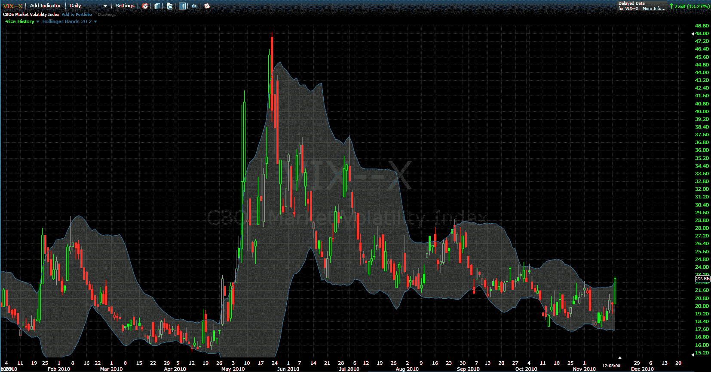

<!--yml

分类：未分类

日期：2024-05-18 16:58:41

-->

# VIX 与更多：VIX 突破上布林带

> 来源：[`vixandmore.blogspot.com/2010/11/vix-punches-through-upper-bollinger.html#0001-01-01`](http://vixandmore.blogspot.com/2010/11/vix-punches-through-upper-bollinger.html#0001-01-01)

VIX 不知道在[爱尔兰](http://vixandmore.blogspot.com/search/label/Ireland)发生了什么，也不知道市场是否低估或高估了[欧洲主权债务危机](http://vixandmore.blogspot.com/search/label/European%20sovereign%20debt%20crisis)的全部程度，不仅在爱尔兰翡翠岛上，在[希腊](http://vixandmore.blogspot.com/search/label/Greece)和[葡萄牙](http://vixandmore.blogspot.com/search/label/Portugal)也是如此。

尽管了解全球政治和经济闪点的信息总是很重要的，但大多数 VIX 交易者更倾向于采取基于技术的方法来交易波动性。在这方面，最简单且最有效的方法是淡化任何 VIX 的极端情况。我在这个博客中介绍了许多衡量 VIX 极端情况的方法。其中最简单的方法之一是使用[布林带](http://vixandmore.blogspot.com/search/label/Bollinger%20bands)来识别邀请高概率[均值回归](http://vixandmore.blogspot.com/search/label/mean%20reversion)交易的 VIX 值。

下图是 VIX 的每日柱形图快照，使用标准的布林带设置（20 天，2.0 标准偏差），显示最近的 VIX 高点 23.06 远高于当前布林带设置的 22.45 上限水平。对于大多数 VIX 交易者来说，这意味着应该做空 VIX，无论欧洲的现实事件如何。

对于那些新手波动性交易者来说，要记住[VIX 暴涨](http://vixandmore.blogspot.com/search/label/VIX%20spikes)有一种聚集并产生恶性循环的习惯。只需往回滚动六个月，就能看到上一次对欧洲主权债务担忧激增时发生了什么，导致 VIX 在一个月内从 15 上升到 48。

相关帖子：

*[来源: FreeStockCharts.com]*

***披露：*** *撰写时做空 VIX*
