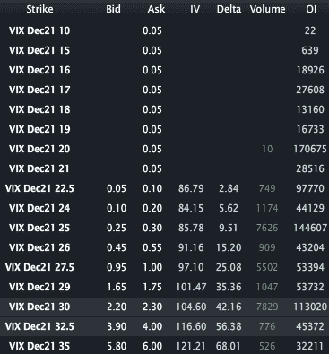

<!--yml

类别: 未分类

日期: 2024-05-18 16:46:54

-->

# VIX and More: VIX 看涨期权看起来很有吸引力

> 来源：[`vixandmore.blogspot.com/2011/12/vix-puts-looking-attractive.html#0001-01-01`](http://vixandmore.blogspot.com/2011/12/vix-puts-looking-attractive.html#0001-01-01)

在接下来的一天或更长时间里，金融市场可能会发生很多事情，根据我的非官方估计，其中相当多的事情不仅令人恐慌，而且可能具有 2008 年的风味。

随着 VIX 达到 30.60，[隐含波动率](http://vixandmore.blogspot.com/search/label/implied%20volatility)确实很高，但不及最近几个月的高点。这听起来可能是购买一些 VIX 看涨期权的好时机，但我有一个与众不同的想法。目前 VIX 看跌期权相对被忽视。VIX Dec 27.50 的询价为 1.00，Dec 30 的询价为 2.30。如果我们看到峰会后波动率的下降，即使有一些悲观的情景，VIX 也有可能会下降，因为对[事件波动率](http://vixandmore.blogspot.com/search/label/event%20volatility)的焦虑已经过去了。

我喜欢说，作为投资组合保护的最佳时间购买 VIX 看涨期权是当 VIX 便宜时，而不是当你认为你需要它时。与此相关的是，购买 VIX 看跌期权的好时机是当其他人以高价抢购看涨期权时。

请记住，VIX 期权有自己的期权周期。本月期权在周三的 21^(st)到期，最后交易日为周二的 20^(th)。

相关帖子：

**

*[来源：LivevolPro.com]*

***披露：*** *Livevol 是 VIX 和 More 的广告商*
