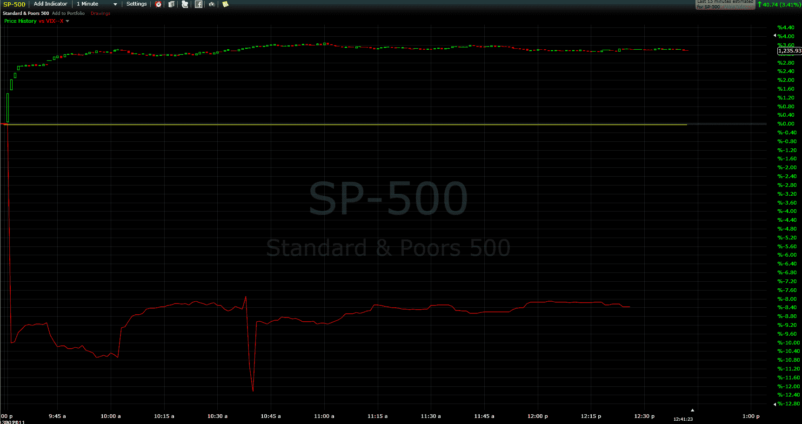

<!--yml

类别：未分类

日期：2024 年 5 月 18 日 16:47:20

-->

# VIX and More: VIX Reflecting Skepticism About Rally

> 来源：[`vixandmore.blogspot.com/2011/11/vix-reflecting-skepticism-about-rally.html#0001-01-01`](http://vixandmore.blogspot.com/2011/11/vix-reflecting-skepticism-about-rally.html#0001-01-01)

当我输入时，标普 500 指数上涨 3.4%，而 VIX 下跌 7.8%，很明显，目前购买股票和在标普 500 指数期权交易之间有相当大的脱离。如果你看今天盘中价格走势的话，更加戏剧性的是标普 500 指数和 VIX 自开盘以来的上升趋势。下面的图像不是理想的去解释相对运动，但如果看今天盘中价格走势，股票和隐含波动率之间异常高的[相关性](http://vixandmore.blogspot.com/search/label/SPX-VIX%20correlation)是明显的。

在“正常”市场条件下，VIX 通常在 SPX 相反方向上的移动速度约为其 4 倍，似乎很多投资者对股票在持续关于欧洲相关新闻的不确定性中仍将继续上涨持怀疑态度。在最初的上涨后，[欧元](http://vixandmore.blogspot.com/search/label/euro) 的价格下跌，当跌至 27 以下后，VIX 现在看起来似乎会保持在 28 以上，并且不会管股票的多头操作。一个简单的解释：投资者正在以类似低价清仓甚至买跌保护的方式购买期权。

相关帖子：

*[来源：FreeStockCharts.com]*

***披露：*** *无*
