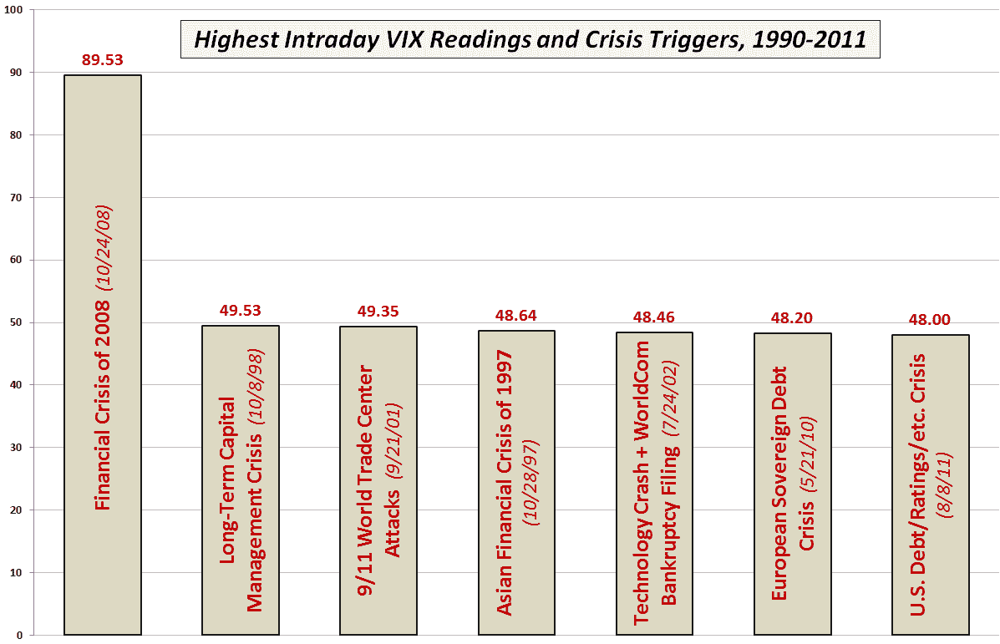

<!--yml

类别：未分类

日期：2024-05-18 16:49:09

-->

# VIX and More：VIX 创下一些新纪录，暗示波动性接近峰值

> 来源：[`vixandmore.blogspot.com/2011/08/vix-sets-some-new-records-suggesting.html#0001-01-01`](http://vixandmore.blogspot.com/2011/08/vix-sets-some-new-records-suggesting.html#0001-01-01)

仅仅一周前，VIX 似乎落后于投资者对股市基本挑战日益增长的焦虑，但在上周四标普 500 指数下跌 4.78%和今天下跌 6.66%之后，VIX 在一周内翻倍至 48.00，似乎与投资者的恐惧完全一致。*[那些想知道 48 的 VIX 意味着什么的人应该考虑，字面意义上的翻译是预测每三天至少有一次 SPX 变化 3%或更多。参见[16 规则和 40 VIX](http://vixandmore.blogspot.com/2010/05/rule-of-16-and-vix-of-40.html)以获取更详细的讨论。]*

如下图所示，48 的 VIX 只把当前危机排在有史以来的第七位 - 或者至少回溯到 1990 年以来的 VIX 数据。从收盘价看，今天的收盘价实际上是 2008-2009 年金融危机以外的最高收盘 VIX。

在研究我的 VIX 数据集时，然而，今天我惊讶地发现 VIX 创下了多项新纪录。例如，今天标志着 VIX 相对于其 10 天、20 天和 50 天简单移动平均线的收盘价达到了最高点。这三个事实在预测未来的[均值回归](http://vixandmore.blogspot.com/search/label/mean%20reversion)行为方面显得非常重要。事实上，我每周为我的[通讯订阅者](http://vixandmore.blogspot.com/search/label/subscriber%20newsletter)发布一个专有的*VIX 均值回归指数*，而今天标志着该指数首次达到 100。

我还有自己的 VIX 公允价值计算方法。今天，我的模型将 VIX 公允价值定在中等 37，这证实了 VIX 均值回归指数的说法。

当然，VIX 肯定能够在未来的较长时期内继续挑战重力，但是赌注是很快就会在 48.00 处达到波动率顶峰。就在我写这篇文章的时候，道琼斯工业平均指数期货已经波动了数百点，因此指望波动率立即停止是不现实的。

更好的是，系好安全带，明天，但不要害怕做空波动率。

相关帖子：

** ****披露：*** *写作时做空 VIX**
