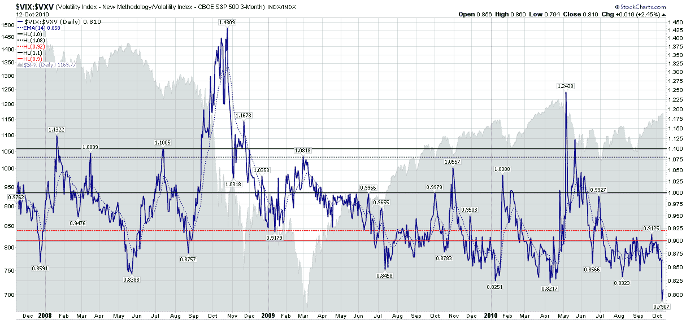

<!--yml

分类：未分类

日期：2024-05-18 17:01:30

-->

# VIX and More: VIX 刷新两项新记录

> 来源：[`vixandmore.blogspot.com/2010/10/vix-sets-two-new-records.html#0001-01-01`](http://vixandmore.blogspot.com/2010/10/vix-sets-two-new-records.html#0001-01-01)

VIX 建立某种新的历史记录并不是每天都会发生的事情，而且波动率指数在连续两天创下两项不同的纪录更是罕见，但这正是本周初的情况。

周一建立的第一项记录是在[VIX:VXV 比率](http://vixandmore.blogspot.com/search/label/VIX%3AVXV)中——我在 VXV 推出后的头一年左右定期报道的一个主题，它实际上是 VIX 的 *93 天* 版本，其正式名称是芝加哥期权交易所标普 500 3 个月波动率指数。

长期读者会记得，在 VXV 推出的第一年，VIX:VXV 比率表现完美无瑕（见[VXV 一周年](http://vixandmore.blogspot.com/2008/11/vxv-is-one-year-old.html)。）然而，在后雷曼时代，由于持续的极端[升水](http://vixandmore.blogspot.com/search/label/contango)使得这个比率更难校准，VIX:VXV 比率变得不一致。然而，我已经做了一些工作，并将分享一些我对如何调整这个比率的想法。

今天创立的最新记录在我的专有[VIX 期货升水指数](http://vixandmore.blogspot.com/search/label/VIX%20Futures%20Contango%20Index)中。一个月前，我在一篇标题为[VIX 期货：他们在想什么？](http://vixandmore.blogspot.com/2010/09/vix-futures-what-wereare-they-thinking.html)的文章中阐述了我对现金/现货 VIX 和[VIX 期货](http://vixandmore.blogspot.com/search/label/VIX%20futures)之间史诗般脱节的一些思考。

最后，VIX:VXV 比率和 VIX 期货升水指数都衡量了同一现象的不同方面：当前波动率读数与未来市场波动率估计的差异程度。我确信，当近期和长期波动率的估计显示出纪录级别的分歧时，会出现一些重要机会。正如我最近多次明确指出的那样，我的想法是，后期的波动率可能会崩溃，以使现在和未来保持一致。在过去两天已经有一些迹象表明这种情况正在发生，但我预计长期波动率预期将继续下降。

在相关说明中，[VXX](http://vixandmore.blogspot.com/search/label/contango)已连续六天创下新低...

相关文章：

*[来源：StockCharts.com]*

***披露：*** *在撰写时通过期权持有 VIX 中立立场*
