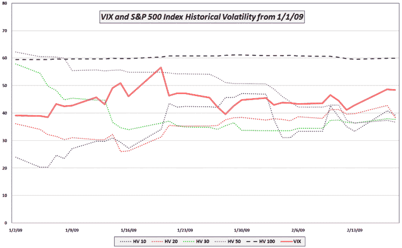

<!--yml

category: 未分类

date: 2024-05-18 17:59:07

-->

# VIX and More: VIX Sluggish as Market Probes Lows

> 来源：[`vixandmore.blogspot.com/2009/02/vix-sluggish-as-market-probes-lows.html#0001-01-01`](http://vixandmore.blogspot.com/2009/02/vix-sluggish-as-market-probes-lows.html#0001-01-01)

一位读者问为什么尽管 SPX 基本持平，VIX 却下跌了近 5%。

除了可能存在统计白噪声的可能性外，还有几个因素可能影响今天相对于 SPX 的 VIX 读数。它们包括：

+   许多新闻周期的不确定性已经消失（季度盈利基本结束，盖特纳就 TARP 2.0 发表了讲话，FOMC 会议记录已经公布，二月份几乎所有重要经济数据都已发布等）。

+   最近大部分波动性出现在银行股（[KBE](http://vixandmore.blogspot.com/search/label/KBE)）中，而银行股在标普 500 指数中所占比例越来越小（两年前金融股（[XLF](http://vixandmore.blogspot.com/search/label/XLF)）占 SPX 的 22%，现在只有 10%）。

+   [VIX 期货](http://vixandmore.blogspot.com/search/label/VIX%20futures)表明预期今年下半年 VIX 将维持在低 40 年代。

+   低波动性导致期权到期 - 尽管周二 SPX 下跌了 4.6%，但在过去五天中，每日收盘变化四次中有四次没有超过+/-1%。

+   VIX 显着高于 SPX 的 10、20、30 和 50 天[历史波动率](http://vixandmore.blogspot.com/search/label/historical%20volatility)，而这些波动率当前均低于 40（见下文）

*[来源：VIXandMore]*
