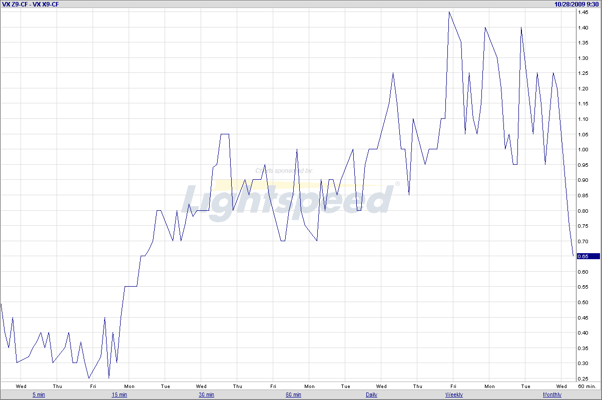

<!--yml

类别：未分类

日期：2024-05-18 17:24:43

-->

# VIX 与更多信息：VIX 飙升和 VIX 期货正套利意味着…

> 来源：[`vixandmore.blogspot.com/2009/10/vix-spike-and-futures-contango-means.html#0001-01-01`](http://vixandmore.blogspot.com/2009/10/vix-spike-and-futures-contango-means.html#0001-01-01)

有时候，我喜欢绕过一些波动性的显著点，而不是试图用它们来砸读者的头，但是由于 VIX 现在比其 10 日简单移动平均线高出 16%，我希望我不是唯一一个做空波动率的人。具体来说，任何关注我关于[VXX](http://vixandmore.blogspot.com/search/label/VXX)的评论的人都应该寻找做空这只 VIX ETN 的机会。

目前，不仅做空 VXX 头寸有[均值回归](http://vixandmore.blogspot.com/search/label/mean%20reversion)的优势，而且即使随着 VIX 飙升，[VIX 期货](http://vixandmore.blogspot.com/search/label/VIX%20futures)仍处于正套利状态，这意味着它们随时间呈上升趋势，次月比当月更昂贵。下图显示，尽管次月 VIX 期货与当月 VIX 期货之间的差异一直在减小，但仍然相当大，这意味着一个有意义的负[滚动收益](http://vixandmore.blogspot.com/search/label/roll%20yield)仍在继续对做空者有利。

最后，不久之前，在大多数经纪人那里，做空 VXX 是困难的。但现在不再是这样了…

有关此主题的额外阅读材料，读者应查阅：

*[来源: FutureSource]*

***披露****：在撰写时做空 VIX 和 VXX。*
