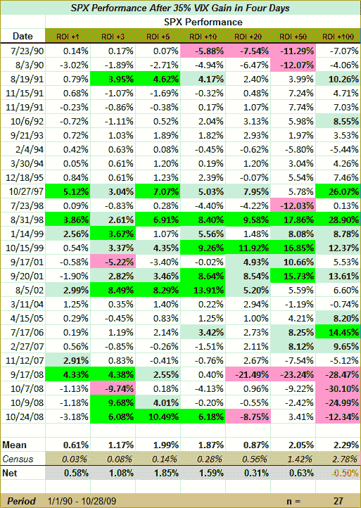

<!--yml

类别：未分类

日期：2024-05-18 17:24:28

-->

# VIX and More: 四天内 35% 的 VIX 暴涨是短期买入信号

> 来源：[`vixandmore.blogspot.com/2009/10/vix-spike-of-35-in-four-days-is-short.html#0001-01-01`](http://vixandmore.blogspot.com/2009/10/vix-spike-of-35-in-four-days-is-short.html#0001-01-01)

我已经有一段时间没有发布我的 VIX 研究了，考虑到最近 VIX 的暴涨，今天的行动似乎是重新审视 [VIX 暴涨](http://vixandmore.blogspot.com/search/label/VIX%20spikes) 作为反向买入机会的好借口。

今天，VIX 收于 27.91，比上周四收盘价 20.69 上涨了 34.9%。在 VIX 的 20 年历史中，波动指数在四个交易日内收盘价上涨 35% 的情况发生了 42 次。如果排除连续出现的 +35% 日的情况，那么在四个交易日内，VIX 跨越 +35% 的情况将有 27 次。我在下面为几个原因重现了这 27 个情况的完整表格。首先，关键是，从时间的角度来看，在 35% 暴涨后进入的长期 SPX 位置通常会在五天的时间范围内表现最佳。在下面的图表中，这 27 个情况平均五天收益为 1.99%，而标准的五天 SPX 收益为 0.14%，净差异为 1.85%。尽管净差异在五天时达到峰值，但它在一天内就变得明显，并持续至少五十个交易日。

诚然，由于我们谈论的是极其波动的时期，相当多的回报都处于分布的尾部，并以绿色和红色突出显示。特别是，这种反向长期策略在 1997 年亚洲金融危机、1998 年俄罗斯金融危机和长期资本管理危机、2001 年的 911 世界贸易中心袭击以及 2002 年[WorldCom](http://vixandmore.blogspot.com/search/label/WorldCom)破产申请后的技术底部反弹时做得非常出色。

与上述出色的市场定时相比，从 2008 年 9 月到 10 月的四个做多信号在 20-100 天期限内的结果也表现出灾难性。然而，在 3-10 天的时间跨度内，这些从多方的做空机会却是绝佳的短期交易机会。但我想要指出的是，如果将表格的最后四行去掉，突然之间，100 天的时间跨度的回报率达到了 6.86%，是“人口普查”回报率的 2.5 倍。很明显的结论是，从表格中可以得出，VIX 波动买入信号在短期内非常可靠，但在较长时间跨度内可靠性较低。这是从表格中得出的关键信息，也是我包含完整数据集的原因。次要的结论是，VIX 波动通常也是不错的长期做多设置，但这里的风险在于它可能预示着一次一两代人的经济崩溃，将抹去十年甚至更长时间的回报。

最后，尽管将统计数据抛向类似的历史情况看起来很好，但重要的是要考虑到，只需要一个“野蛮”的 GDP 数字就可以给一组吸引人的统计数据添麻烦。明天将会很有趣 —— 而且我预计牛市将投入大量资金，不管 GDP 数据如何。

欢迎阅读相关主题的帖子，详情请查看：

***免责声明****：撰写时持有 VIX 空头仓位。*
