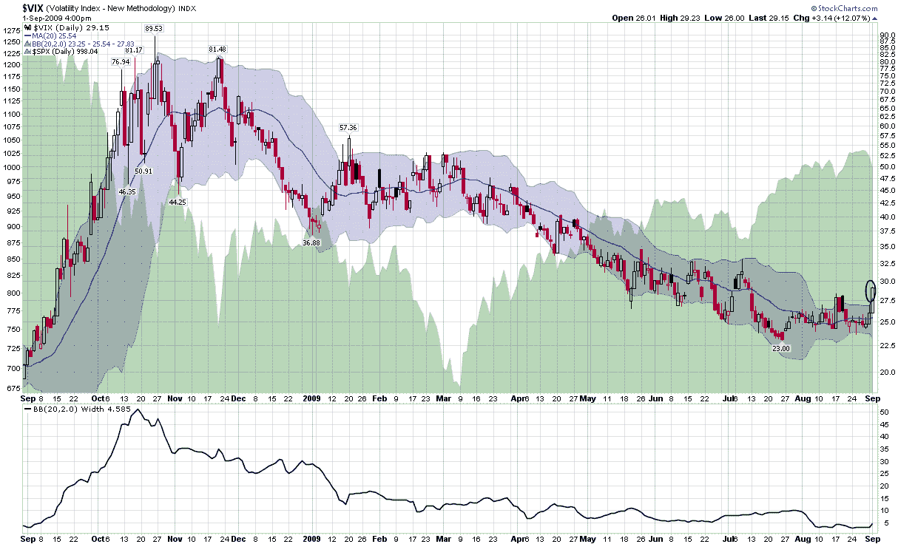

<!--yml

类别：未分类

日期：2024-05-18 17:31:03

-->

# VIX and More: VIX 突破布林带上轨

> 来源：[`vixandmore.blogspot.com/2009/09/vix-spikes-above-bollinger-bands.html#0001-01-01`](http://vixandmore.blogspot.com/2009/09/vix-spikes-above-bollinger-bands.html#0001-01-01)

昨天的波动率指数（VIX）飙升了 12%，将波动率指数推高至其[10 天简单移动平均](http://vixandmore.blogspot.com/search/label/10%20day%20SMA)的 13.8%以上。正如此前多次提到的那样，当 VIX 至少比其 10 天简单移动平均高出 10%时，这通常是启动短期[均值回归](http://vixandmore.blogspot.com/search/label/mean%20reversion)操作并做多 SPX 和/或做空 VIX 的好时机。

尽管我在这个空间中没有经常讨论，但另一个有用的 VIX 均值回归信号可以从使用[布林带](http://vixandmore.blogspot.com/search/label/Bollinger%20bands)来判断 VIX 是否过度延伸并可能回弹。最简单的方法是监控当 VIX 收盘价超过 20 天、2 标准差回溯期的上轨时。

下图使用标准的 20 天、2 标准差布林带来评估过去一年中 VIX 的走势。请注意，在去年 9 月和 10 月持续最大的 VIX 飙升后，VIX 很少收盘超过上轨。在 1 月份有一次收盘远超上轨的情况，标志着短期看涨行情，然后在 2 月底和 3 月初有两次收盘超过上轨，这标志着市场触底和强劲反弹的开始。

从历史标准来看，昨天的收盘价较上轨高出 4.7%，是一个相当大的突破，表明存在短期看涨偏好。然而，考虑到[布林带宽](http://vixandmore.blogspot.com/search/label/Bollinger%20band%20width)的收窄情况（底部研究），显然，与 1 月份相比，VIX 围绕 50 左右盘整时，穿透上轨所需的移动要小得多。

最近似乎每个人都在寻找回撤。一个重要的问题是需要多大程度的回撤才能满足熊市，并且多久之后“买回调”心态会再次占据主导地位。

对于一些相关的帖子，请尝试：

*[图表来源：StockCharts.com]*
