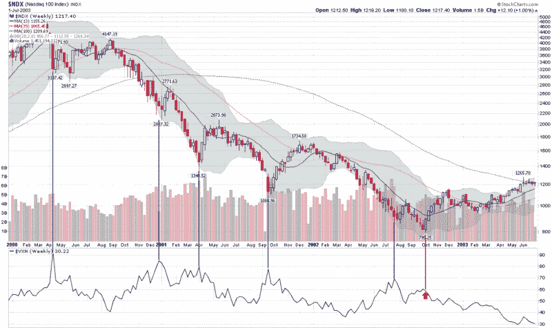

<!--yml

类别：未分类

日期：2024-05-18 18:26:54

-->

# VIX and More：VIX 飙升与 2002 年市底

> 来源：[`vixandmore.blogspot.com/2008/09/vix-spikes-and-2002-market-bottom.html#0001-01-01`](http://vixandmore.blogspot.com/2008/09/vix-spikes-and-2002-market-bottom.html#0001-01-01)

由于 VIX 今早飙升超过 30，并且投资者们在想市场是否会找到底部，现在似乎是谈论[VIX 飙升](http://vixandmore.blogspot.com/search/label/VIX%20spikes)和[市场底部](http://vixandmore.blogspot.com/search/label/market%20bottoms)的好时机。 具体来说，我想打破一个神话，即熊市必须在一场包含戏剧性波动飙升的宏伟投降高潮中结束。

一个完美的反例可以在随之而来的纳斯达克繁荣之后的熊市中找到，该繁荣在 2000 年 3 月达到顶峰。 实际上，除了当前的熊市外，2000-2002 年熊市是自 1993 年 VIX 推出以来或 CBOE 历史重建的 VIX 数据追溯至 1990 年以来唯一的熊市。

与其使用 SPX 和 VIX 来证明我的观点，下面的图表使用纳斯达克 100 指数（[NDX](http://vixandmore.blogspot.com/search/label/NDX)）及其伴侣波动率指数[VXN](http://vixandmore.blogspot.com/search/label/VXN)。 我选择 NDX 的原因是，从 2000 年 3 月 24 日的高点（4816.35）到 2002 年 10 月 8 日的低点（795.25），NDX 的价值损失惊人的 83.5%。 如果说有机会目睹戏剧性的暴跌和投降，那么这个市场和指数就是最佳选择。

如果你看一下 2000-2002 年 NDX 和 VXN 的图表，可以看到五个明显的 VXN 飙升点。 我在下面的图表中用蓝色竖线突出显示了这些点，以便参考。 结果表明，那些在这些波动性飙升时期做多的人，会看到两周到几个月的大部分时间是横向行动。 这些飙升点没有一个预示着一个持久的市底。

当 NDX 最终触底（用红色竖线和箭头标注），VXN 几乎没有什么波动。 是的，过去二十年中最严重的熊市以波动性的微弱结束。 我喜欢称这种底部行动为“[隐秘底部](http://vixandmore.blogspot.com/search/label/stealth%20bottom)”。

投降以各种形状和大小出现。 大多数市底都标志着 VIX 飙升。 但是，如果你认为波动性的飙升将标志着市底，而没有 VIX 飙升就不能形成市底，那么你将忽视最近可能最重要的熊市中的一个重要教训。

[来源：StockCharts, VIX and More]
