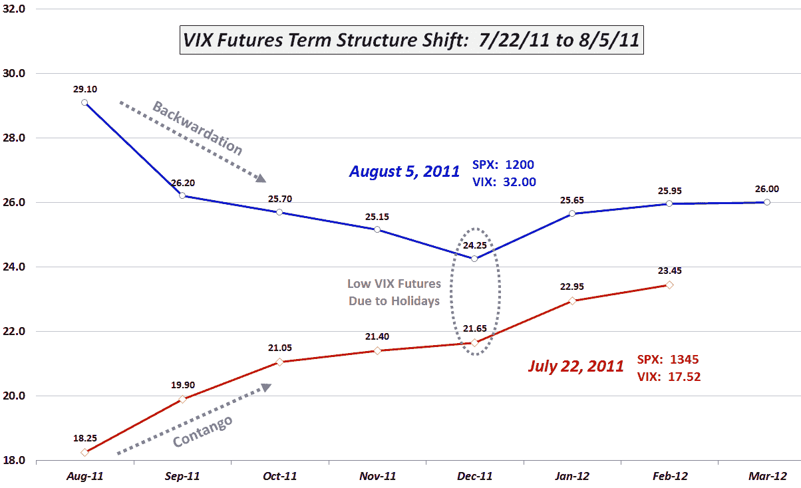

<!--yml

类别：未分类

日期：2024 年 05 月 18 日 16:49:22

-->

# VIX and More: VIX Term Structure Evolution Over Last Ten Days

> 来源：[`vixandmore.blogspot.com/2011/08/vix-term-structure-evolution-over-last.html#0001-01-01`](http://vixandmore.blogspot.com/2011/08/vix-term-structure-evolution-over-last.html#0001-01-01)

如果你认为过去两周已经将投资世界颠倒过来，那么你只需要看看[VIX 期货](http://vixandmore.blogspot.com/search/label/VIX%20futures) [期限结构](http://vixandmore.blogspot.com/search/label/term%20structure)就可以看出这一观点是多么准确。两周前，VIX 在 17 点左右，而 VIX 期货期限结构处于[顺差](http://vixandmore.blogspot.com/search/label/contango)（向上倾斜），而今天，VIX 收盘在 32 点，VIX 期货期限结构处于[反转](http://vixandmore.blogspot.com/search/label/backwardation)。事实上，当前的 VIX 期限结构看起来非常像两周前的镜像。

在下面的图表中，我详细说明了从 7 月 22 日到今天收盘时期限结构的变化。在这段期间，标普 500 指数下跌了 10.8%，而 VIX 飙升了 82.6%。请注意，前端月份（8 月）的 VIX 期货大幅上涨，此期间上涨了 59%——但不及 VIX 上涨得厉害。观察期限结构的后端，2012 年 3 月的期货在 7 月 22 日没有交易，因此 2 月期货是我们可以比较价格的最远期货。它们的走势大幅落后于 VIX 和前端期货，并且在这两周内的涨幅几乎与 SPX 相同，上涨了 10.7%。可以清楚地看到，从期限结构线所形成的漏斗中可以看出，对于结构中每个月来说，VIX 期货对于 SPX 或 VIX 的变动反应较弱。

除了在图表中注释反转和顺差外，我还圈出了 12 月 VIX 期货和期权到期日（12 月 21 日），以预防一些关于为什么这些期货现在和两周前看起来异常低的问题。简单的答案是年底假期较多，交易日较少，这意味着波动率的扩大机会较少。我之前多次讨论过这种现象（首先请参阅[VIX 和圣诞节前一周](http://vixandmore.blogspot.com/2010/12/vix-and-second-half-of-december.html)），并将其命名为“[假日效应](http://vixandmore.blogspot.com/search/label/Holiday%20Effect)”或“[日历逆转](http://vixandmore.blogspot.com/search/label/calendar%20reversion)”。“还要注意，12 月份股票相对而言历史上表现相对牛市，波动性较低。

最后，我收到了不少关于昨天 35.4%的[VIX 激增](http://vixandmore.blogspot.com/search/label/VIX%20spikes)的影响的问题。这里有一些关于[30% VIX 激增的短期和长期影响](http://vixandmore.blogspot.com/2010/04/short-term-and-long-term-implications.html)的先前研究，无疑会引起大多数读者的兴趣。简单来说，这一事件对股市是利好的，对波动性是利空的。我预计这一事实将在周一开始显现更多证据。

相关帖子：

**** **[来源：互动券商]*  ***披露：*** *在撰写本文时持有 VIX 空头****
