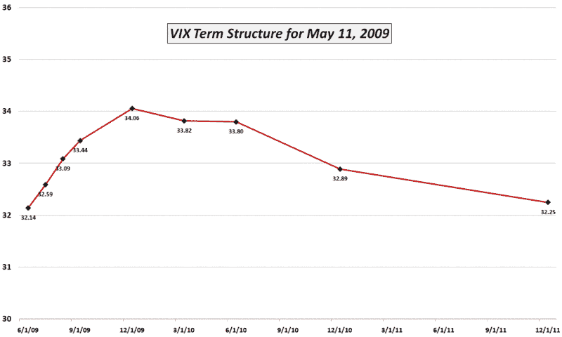

<!--yml

category: 未分类

date: 2024-05-18 17:47:54

-->

# VIX and More: VIX Term Structure and VIX Forecasts

> 来源：[`vixandmore.blogspot.com/2009/05/vix-term-structure-and-vix-forecasts.html#0001-01-01`](http://vixandmore.blogspot.com/2009/05/vix-term-structure-and-vix-forecasts.html#0001-01-01)

上周五，彭博社的杰夫·基恩斯（Jeff Kearns）发表了一篇标题为[VIX 期货显示交易员押注股市涨势将终结](http://www.bloomberg.com/apps/news?pid=20601084&sid=aL67pJSx90Is&refer=stocks)的文章，这篇文章引发了大量读者的电子邮件。文章中最引起人们兴趣的引述是：“由[宏观风险顾问](http://www.macroriskadvisors.com/)进行调查的投资者预计，到年底，VIX 将飙升至 51.70。” 实际上，51.70 数据点是四月份调查对象预期的高点平均值，当时 VIX 在 33 到 46 之间。这个数据点和来自[波动率预测调查](http://www.macroriskadvisors.com/layout/pdf/Volatility_Forecast_Survey_2009.pdf)的其他结果都很有趣。更有趣的是，然而，2008 年 4 月的[波动率预测调查](http://www.macroriskadvisors.com/layout/pdf/MRA1_VOLSURVEY20Updated.pdf)，调查对象预期 2008 年余下时间的平均实现波动率为 20.9%，VIX 的平均高点为 34.4。有一个勇敢的人冒险预测 VIX 将飙升至 50，创历史新高。

我猜没人知道 5 级风暴 VIX 是什么样子，所以根据历史数据进行推断，他们很难想象接下来会发生什么。

回到 2009 年的调查数据，虽然我觉得很有趣，但我会对几周前的调查数据给予较少的信任，而不是实时市场数据。人们可以从 VIX 期货或 SPX 期权构建 VIX [期限结构](http://vixandmore.blogspot.com/search/label/term%20structure)图。我更倾向于后者的方法，因为它产生了像下面这样的图表。请注意，VIX 期限结构的斜率几乎是平的。显然，前月和 2 年半期间的 0.11 差异与 2008 年 11 月 20 日的 33.93 点差异形成了鲜明对比，当时前月 VIX 为 81.07。基本上，共识意见是当前的波动率测量值大致处于应有水平，并且预计未来不会出现重大变化。

最后，尽管上个月调查对象在制定其[波动率预测](http://vixandmore.blogspot.com/search/label/volatility%20forecast)时可能怀有最良好的意图，但没有什么比当前市场数据更能体现投资者如何通过期权市场的大额美元头寸支持其信念的。

*[来源：CBOE，VIXandMore]*
