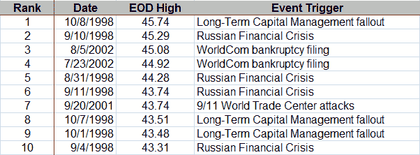

<!--yml

分类：未分类

日期：2024 年 05 月 18 日 18:24:27

-->

# VIX and More: VIX 十大最高收盘价

> 来源：[`vixandmore.blogspot.com/2008/09/vix-top-ten-highest-end-of-day-closes.html#0001-01-01`](http://vixandmore.blogspot.com/2008/09/vix-top-ten-highest-end-of-day-closes.html#0001-01-01)

在下文[前五个 VIX 暴涨](http://vixandmore.blogspot.com/2008/09/top-five-vix-spikes.html)中，我详细说明了一天内达到的最高 VIX 值。在下面的表格中，我列出了 VIX 的十个最高收盘价。关于“事件触发器”，俄罗斯金融危机和[长期资本管理](http://vixandmore.blogspot.com/search/label/Long%20Term%20Capital%20Management)的问题之间的分界线有些任意。为了简单起见，我将 1998 年 9 月 21 日视为[俄罗斯金融危机](http://vixandmore.blogspot.com/search/label/Russian%20financial%20crisis)和 LTCM 情况的公开知识之间的分界点。

注意，每日 VIX 计算是在美国东部时间下午 4:15 进行的，因此这些数字反映了一小段盘后活动。

还有大约一小时的交易时间，当前的 46.38 将成为 VIX 的新纪录收盘价。

