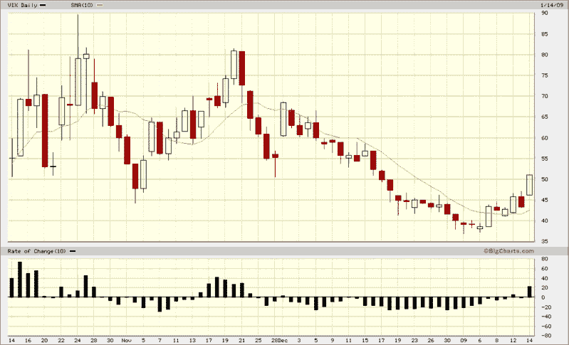

<!--yml

category: 未分类

date: 2024-05-18 18:06:13

-->

# VIX 和更多：VIX 自 12 月中旬以来首次突破 50

> 来源：[`vixandmore.blogspot.com/2009/01/vix-tops-50-for-first-time-since-mid.html#0001-01-01`](http://vixandmore.blogspot.com/2009/01/vix-tops-50-for-first-time-since-mid.html#0001-01-01)

SPX 在早盘未能在 850 点找到支撑，金融股今早再度下跌 6%，VIX 已经飙升至 51.03，今天迄今为止上涨了 17.9%，比六个交易日前上涨了 32.3%。

自开盘以来大幅下跌后，今天的行动更像是缓慢地挣扎，而不是急剧的恐慌，这表明下行的空间可能还有相当大的距离。SPX 的支撑可能出现在 820-830 的区间，但如果这些水平无法保持，重新下跌至 740 的可能性突然变得很大。

*[source:  BigCharts]*
