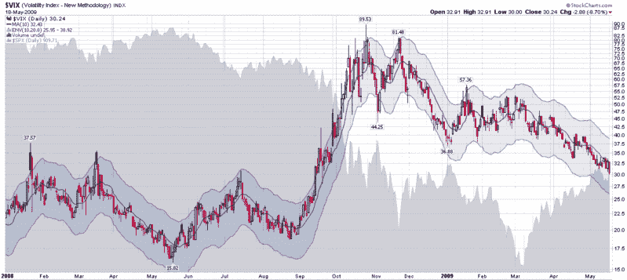

<!--yml

类别：未分类

日期：2024-05-18 17:47:11

-->

# VIX 及更多：VIX 触及 30.00，定格在 30.24

> 来源：[`vixandmore.blogspot.com/2009/05/vix-touches-3000-settles-at-3024.html#0001-01-01`](http://vixandmore.blogspot.com/2009/05/vix-touches-3000-settles-at-3024.html#0001-01-01)

今天，NYSE 正常交易结束时间为美国东部时间下午 4:00，此时 VIX 指数为 30.02，然后在收盘后下降到 30.00，且在下午 4:15，指数交易会话结束时上涨至 30.24。

收盘价是自 9 月 12 日以来的最低值，这是雷曼兄弟宣布破产的前一个周五。

总的来说，VIX 现已持续 170 个交易日收于 30 水平以上。这远远超过了 1998 年连续关闭 49 天的记录以及 2002 年关闭 30+天的 47 天记录。

唯一有用的长期波动性的历史比较来自[1987](http://vixandmore.blogspot.com/search/label/1987)-1988 年，那时为[VXO](http://vixandmore.blogspot.com/search/label/VXO)（‘原始 VIX’计算）重建的数据表明，‘原始 VIX’曾连续保持在 30 水平以上的时间长达 86 天-大约是当前持续波动性期间的一半。

用不同的视角看待 VIX 的 30 水平可能会有所帮助，或许值得考虑，从 2003 年 3 月到 2007 年 8 月，VIX 从未收于 30 水平。 从 2003 年 4 月到 2007 年 8 月，甚至连续几日也没有达到 30 水平。

最后，2001 年是 VIX 迄今为止整个日历年度中标志性的低位水平的年份。 2001 年的低 VIX？仅为 18.74。

明天，我会想一些 VIX 在 2009 年余下时间可能范围的想法。

同时，欲了解 1987-88 年间市场波动性情况，请查看[波动性的持续性](http://vixandmore.blogspot.com/2009/04/persistence-of-volatility.html)和 [波动性历史课：1987](http://vixandmore.blogspot.com/2008/03/volatility-history-lesson-1987.html). 想了解更多 VXO 的信息，包括在[黑色星期一](http://vixandmore.blogspot.com/search/label/Black%20Monday)之后该指数的表现如何，请浏览 [1987-1988 年 VXO 图表及 VIX 与 VXO 的解释](http://vixandmore.blogspot.com/2008/10/vxo-chart-from-1987-1988-and.html)。

**

*[来源：StockCharts]*
