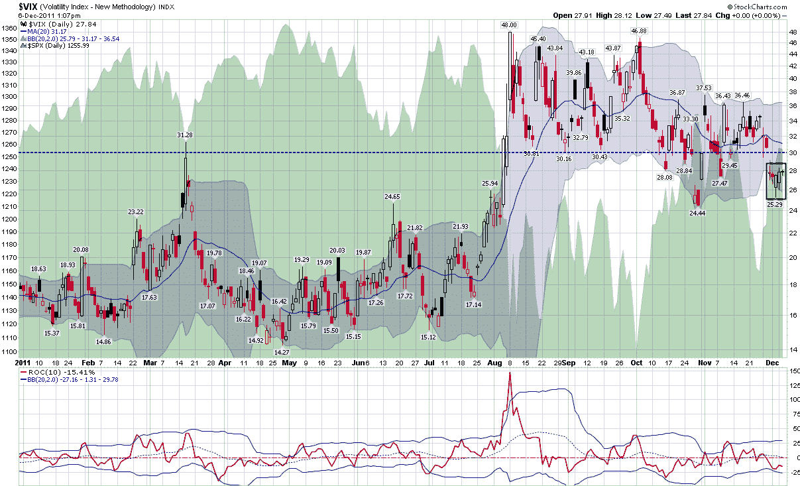

<!--yml

分类：未分类

日期：2024 年 5 月 18 日 16:47:05

-->

# VIX and More: VIX Under 30 Five Days in a Row?

> 来源：[`vixandmore.blogspot.com/2011/12/vix-under-30-five-days-in-row.html#0001-01-01`](http://vixandmore.blogspot.com/2011/12/vix-under-30-five-days-in-row.html#0001-01-01)

今天还很年轻，传闻一直异常安静，但我认为值得注意的是，恐慌指数（VIX）似乎已经连续五天（绿色方框）没有突破心理重要水平 30.00（虚线黑线）了，这是自 7 月以来的首次。

对于那些在家中或办公室中进行记录的人，截至昨天已经过去了两个月，VIX 超过了 40.00 水平。

下图显示了 2011 年迄今为止 VIX 的路径，有点像是[尼斯湖水怪](http://en.wikipedia.org/wiki/Loch_Ness_Monster)或者已经竖起身子准备攻击的眼镜蛇。如果你愿意，可以称之为[Rorschach](http://en.wikipedia.org/wiki/Rorschach_test)两栖动物。

我还在主图下方添加了一个 10 天的变化率研究，以强调虽然 VIX 的绝对水平很重要，但最近的变化率有时可能是一个更好的衡量市场情绪演变的指标。

鉴于围绕着一个由 17 个具有非常不同动机的多样化行为者所构成的群体所带来的不确定性，这些动机来自于不同的国家议程、经济利益和国内政治局势，可以合理地预期 VIX 和其他不确定性指标在本周末峰会之前会上升。到目前为止，标普 500 指数（SPX）的行动是过去五个月来单日范围最窄的。下一个[破坏者](http://en.wikipedia.org/wiki/Clog_%28shoe%29)何时会出现？

*[来源：StockCharts.com]*

***免责声明：*** *无*
