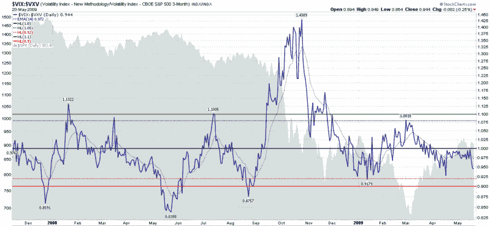

<!--yml

分类：未分类

日期：2024-05-18 17:46:39

-->

# VIX and More: VIX:VXV Ratio Moving Toward Bearish Zone

> 来源：[`vixandmore.blogspot.com/2009/05/vixvxv-ratio-moving-toward-bearish-zone.html#0001-01-01`](http://vixandmore.blogspot.com/2009/05/vixvxv-ratio-moving-toward-bearish-zone.html#0001-01-01)

最近我收到了很多关于[VIX:VXV 比率](http://vixandmore.blogspot.com/search/label/VIX%3AVXV)的请求，这是我在 2007 年 12 月首次写博客介绍的内容，那时[VXV](http://vixandmore.blogspot.com/search/label/VXV)波动率指数刚刚[推出](http://vixandmore.blogspot.com/2007/12/thinking-about-vxv.html)。

下图是我的标准 VIX:VXV 比率图表，使用每日收盘水平的 1.08 和 0.92 作为基本的长期和短期信号。图表上的最后一个信号是 3 月 1 日的长期信号，领先于 3 月份的底部一个星期。4 月 19 日，VIX:VXV 比率收于 .9276，但在日内基础上低于 0.92 的信号线。

昨天，我看到一些数据显示，在交易时段，VIX:VXV 比率低于 0.92，但是对日内图表的审查告诉我，虽然 VIX:VXV 比率从美东时间上午 9:50 至晚上 10:10 区间在 0.9150 到 0.9200 区域，任何更低的数字可能是错误打印的结果。

作为记录，尽管昨天的 0.944 收盘表明了一种悲观的倾向，但我对比率的解读是，偏空仓位的首选入场点需要等待收盘在 0.92 或以下。

*[请注意，尽管这个对 VIX:VXV 比率的基本解释设置了长期和短期进入的参数，但它不包括有关退出或如何将 VIX:VXV 比率纳入交易系统的建议。]*

*[来源：StockCharts]*

***披露****：写作时持有 VIX 仓位。*
