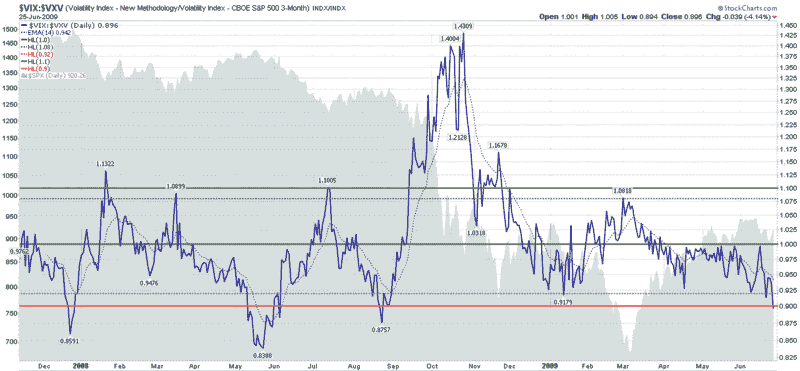

<!--yml

分类：未分类

日期：2024-05-18 17:41:23

-->

# VIX and More: VIX:VXV Ratio Sell/Short Signal

> 来源：[`vixandmore.blogspot.com/2009/06/vixvxv-ratio-sellshort-signal.html#0001-01-01`](http://vixandmore.blogspot.com/2009/06/vixvxv-ratio-sellshort-signal.html#0001-01-01)

今天 VIX 收于 26.36，比周一的 31.17 下跌了 15.4%，达到了 2008 年 9 月 12 日 25.66 的收盘水平，即雷曼兄弟宣布破产的前一个交易日的最低收盘水平。

根据经典的 10 日简单移动平均测量法，目前的 VIX 比该水平低 11.7%，根据[TradingMarkets 5%规则](http://vixandmore.blogspot.com/2007/07/tradingmarkets-5-vix-rule.html)以及其他交易者使用的更严格的 10%阈值，VIX 现在处于“卖超”位置。

从波动率[期限结构](http://vixandmore.blogspot.com/search/label/term%20structure)的角度来看，VIX 也被卖超了。值得注意的是，[VIX:VXV 比率](http://vixandmore.blogspot.com/search/label/VIX%3AVXV)，它比较了 SPX 期权的 30 天波动率和 93 天波动率（使用[VXV](http://vixandmore.blogspot.com/search/label/VXV)指数），今天的收盘价为 0.896。在下面的图表中，您可以看到当这个比率收于 0.92 或以下时，熊市往往在至少几周内占据上风。当比率下跌到 0.90 以下时，就像今天的情况一样，熊市的胜算会更有利。

简言之，VIX:VXV 比率目前的低水平表明期权交易者在 30 天的展望（[事件波动率](http://vixandmore.blogspot.com/search/label/event%20volatility)）相对于 93 天的展望（[结构波动率](http://vixandmore.blogspot.com/search/label/structural%20volatility)）过于乐观和自满。虽然这两个波动率测量可以通过降低长期结构波动率的估算来调整，但最容易实现的路径是短期事件波动率上升。这意味着 VIX 更有可能向 VXV 的方向移动，今天收盘价为 29.41。当然，波动率上升往往有利于熊市而不利于牛市。即使在今天的强劲收盘之后，多头也应考虑获利和/或建立空头仓位。

*[来源：StockCharts]*

***披露****：撰写时持有 VIX 多仓位。*
