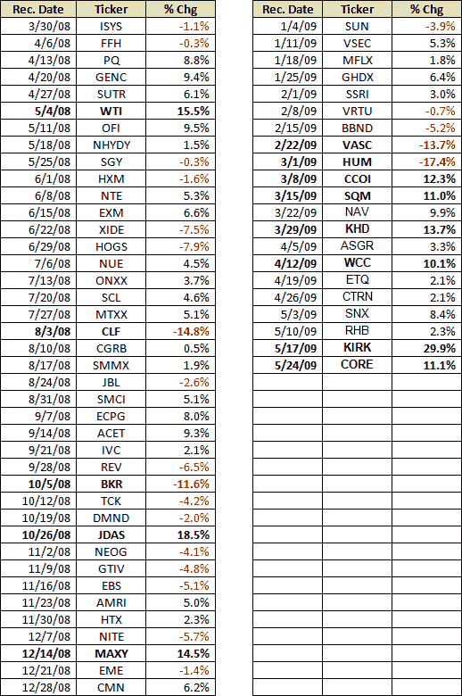

<!--yml

category: 未分类

date: 2024-05-18 17:45:47

-->

# VIX and More: VIX and More Stock of the Week Selection Up 343% in 14 Months

> 来源：[`vixandmore.blogspot.com/2009/05/stock-of-week-selection-up-373-in-14.html#0001-01-01`](http://vixandmore.blogspot.com/2009/05/stock-of-week-selection-up-373-in-14.html#0001-01-01)

2008 年 3 月，我推出了[*VIX and More*订阅者通讯](http://vixandmore.blogspot.com/search/label/subscriber%20newsletter)，我向自己保证很少提及该通讯，并继续将大部分时间和精力投入到产生其他公共领域中不可获得的图表和分析上。

保持教堂与国家的分隔并不总是一件容易的事，但上个月，一个长期的朋友和经常访问博客的人发现我已经发布了一年多的通讯而不知情时，他对我保持通讯秘密的能力感到惊讶和有些失望。

为了消除一些保密性，我想强调一下通讯的每周特色之一，这已经成为我妻子以及一些读者的最爱。我称之为[本周股票](http://vixandmore.blogspot.com/search/label/stock%20of%20the%20week)（SOTW）‘顺序投资组合’。称其为投资组合可能有点夸张，因为自我设定的规则规定每周整个投资组合都投资于一支股票，该股票在周初购买，并在周末出售，无论其表现如何。我喜欢把它想象成一种股权接力赛。如果一支股票犯错或疲劳，总会有另一支在下一个转弯处接过接力棒。

SOTW 的目的是每周突出一个股票，通常有些超出常规的，我认为基本面和技术上值得拥有。尽管所有头寸只能是长期的，且限于一周，但 SOTW 的目的不是鼓励读者跟随一支股票一周，而是每周生成一个可能值得进一步调查和延长持有期的新想法。

我决定现在在这里发布本周的股票的原因是，自从我在 14 个月前的第一个订阅者通讯中提出这个想法以来，这个只能长期持有的单支股票投资组合的累计回报率已经达到了+343.2%。在那段时间里，基准 S&P 500 指数下跌了大约 31.7%。

由于 SOTW 已经连续 11 周取得了胜利，并且由于本周选项中的一次大幅度移动（本周选择的核心-Mark 控股公司【CORE】），本周已经上涨 11.1%，因此我决定从今以后每周的第一交易日后发布每周选择，只要连胜继续。

对于那些感兴趣的人，我在下面发布了整个 SOTW 选项的完整历史。

请注意，股票选择并非本简报的主要焦点。相反，有九个常规每周特色，如下所示：

1.  本周回顾：市场动态

1.  市场评论

1.  下周展望：值得关注的事项

1.  市场情绪（使用专有的综合市场情绪指标）

1.  波动率角落（讨论 VIX 和其他波动率指数/产品，如 VXV、VXX、专有的全球波动率指数等）

1.  资产类别展望（十种资产类别的短期、中期和长期展望）

1.  当前投资论点

1.  VIX 和更多重点模型投资组合（成长和外国成长）

1.  本周股票

欲了解更多关于《VIX 和更多订阅者简报》以及我提供的为期 14 天的免费试用，请访问[VIX 和更多订阅者简报博客](http://vixandmoresubscriber.blogspot.com/)。

*[来源：VIX 和更多]*
