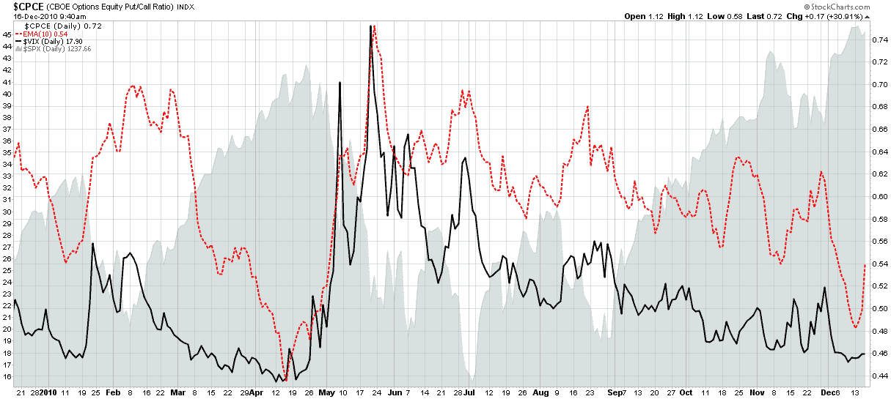

<!--yml

类别：未分类

日期：2024-05-18 16:56:14

-->

# VIX and More: VIX and Put to Call Ratio Snapshot

> 来源：[`vixandmore.blogspot.com/2010/12/vix-and-put-to-call-ratio-snapshot.html#0001-01-01`](http://vixandmore.blogspot.com/2010/12/vix-and-put-to-call-ratio-snapshot.html#0001-01-01)

最近博客圈内一直在讨论最近的高[看涨看跌比率](http://vixandmore.blogspot.com/search/label/put%20to%20call)，包括我昨天的帖子，[Rohan Clarke on the VIX and Put to Call Ratios](http://vixandmore.blogspot.com/2010/12/rohan-clarke-on-vix-and-put-to-call.html)。

鉴于这个主题引起了很多关注，我觉得现在是分享我经常参考的一个简单图表的好时机。下面的图表捕捉到了 VIX（实线黑色）和 CBOE 股票看涨看跌比率的 10 日指数移动平均值（[CPCE](http://vixandmore.blogspot.com/search/label/CPCE)），它显示为虚线红色。

注意这两个指标通常高度相关。它们都在 4 月份达到了极低水平，就在股票开始调整之前 - 因此对当前情况的担忧。最近的水平标志着年度第二低读数，并且可能也预示着一种逆转。然而，需要注意的是，VIX 可能会持续较低一段时间，也只能表明投资者愿意承担更多风险。此外，CPCE 的 10 日 EMA 显示出一些迹象，表明最近的极端读数可能在熊市能够获得任何重要支撑之前自我校正。最后，季节因素往往会扭曲这两个指标，并且通常指向短期假日的自满，而不是预计会持续到 2011 年的任何一种信念。

相关帖子：

***披露：*** *无*

*[来源：StockCharts.com]*
