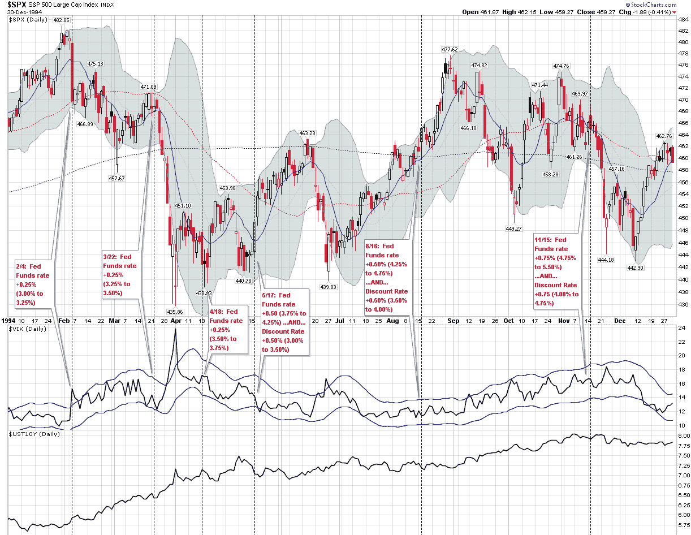
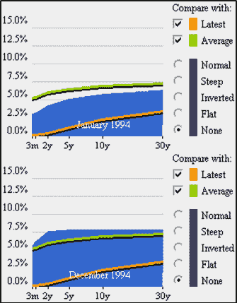

<!--yml

category: 未分类

date: 2024-05-18 16:15:34

-->

# VIX 和更多：1994 年利率上升周期期间的 VIX 和 SPX

> 来源：[`vixandmore.blogspot.com/2013/06/vix-and-spx-during-1994-interest-rate.html#0001-01-01`](http://vixandmore.blogspot.com/2013/06/vix-and-spx-during-1994-interest-rate.html#0001-01-01)

在昨天的[《VIX 和 FOMC 前后交易》](http://vixandmore.blogspot.com/2013/06/the-vix-and-pre-fomc-post-fomc-trades.html)文章发布后，我意识到我提到的[1994 年的一系列加息](http://vixandmore.blogspot.com/search/label/1994)可能会超出当前一代投资者的记忆范围。因此，在所有关于美联储削减购买量和最终结束定量宽松的焦虑之中，我认为现在是回顾当美联储意外采取一系列加息行动时股票和波动率的表现的好时机。

要设置上下文，90 年代始于与第一次海湾战争同时发生的衰退，伴随着油价的急剧上涨。美联储从 1989 年到 1992 年逐渐降低了利率，这有助于创造一个有利于复苏的环境，但这种复苏需要一些时间才能获得动力，并且直到 1991 年才开始。股市在这段时间内表现比经济好；在 1990 年的下跌之后，股票在 1991 年、1992 年和 1993 年实现了涨幅。经过一个对股市有利的一月份，1994 年似乎也在走向成功的道路上。

正是在这个时候，美联储主席艾伦·格林斯潘决定在派对失控之前拿走这个俗语中的酒碗，于 1994 年 2 月 4 日，美联储宣布将联邦基金利率上调 0.25％，令市场感到意外。到 1994 年结束时，美联储已经六次提高了利率。如下图所示，头三次的加息都是联邦基金利率上调 0.25％，但后来加息的幅度增加到了 0.50％，最终在年底增加到了 0.75％，同时还伴随着联邦贴现率的提高，该比率也从 0.50％提高到了 0.75％。到 1994 年结束时，联邦基金利率已经从 3.00％上升到 5.50％，联邦贴现率已经从 3.00％上升到 4.75％。（加息周期最终于 1995 年 2 月 1 日结束，当时美联储将联邦基金利率上调至 6.00％，联邦贴现率上调至 5.25％。）

请记住，艾伦·格林斯潘在那些日子里并不相信暗示美联储的意图；相反，他是一个模糊其辞的大师，他常常含糊其辞的语言通常让投资者对他的意图一无所知。因此，市场很难预测美联储的下一步行动，投资者也未必为随后的加息做好准备。

金融市场如何应对实际上相当于联邦基金利率翻倍和联邦贴现率增加超过 50%的情况呢？与人们可能想象的波动要小得多。1994 年 VIX 的平均收盘值为 13.93，与 2013 年的 13.90 相差不大。虽然 VIX 在 4 月 4 日曾一度飙升至 28.30，但整整一年只有两天 VIX 收盘价超过 20.00！标普 500 指数年底以微小的亏损收官（如果将股息计入计算，则会有微小的收益），但在随后的五年中，以 34%、20%、31%、27%和 20%的涨幅回归。

*[来源：StockCharts.com，纽约联邦储备银行，VIX and More]*

这一系列加息确实大幅改变了[收益曲线](http://vixandmore.blogspot.com/search/label/yield%20curve)，如下图所示。更戏剧性的变化出现在期限结构的前端，到 1994 年底，曲线从两年到三十年基本上是平的。

*[来源：华尔街日报/SmartMoney]*

因此，尽管罗宾·哈丁（Robin Harding）昨天在《金融时报》上的文章 [美联储可能会示意缩减行动即将到来](http://www.ft.com/intl/cms/s/0/1f6e6926-d75e-11e2-8279-00144feab7de.html)（以及他随后的推文，“美联储不会向任何记者泄露任何信息来引导市场 - 尤其是在封锁期间”）也许给了投资者一个练习最终缩减的机会，但 1994 年的历史记录表明，缩减的担忧可能夸大了量化宽松的最终局面。

相关帖子：

***披露：*** *无*
