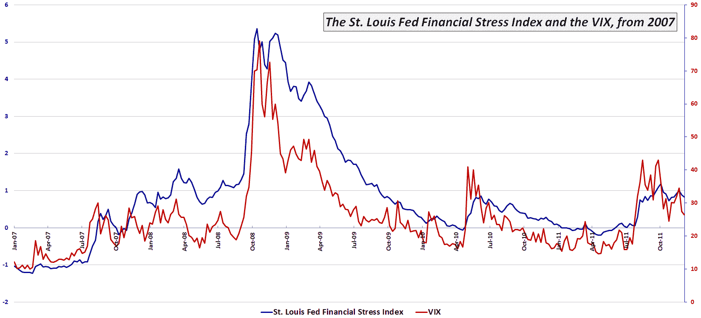

<!--yml

category: 未分类

date: 2024-05-18 16:45:33

-->

# VIX and More: VIX and St. Louis Fed’s Financial Stress Index Moving in Concert

> 来源：[`vixandmore.blogspot.com/2011/12/vix-and-st-louis-feds-financial-stress.html#0001-01-01`](http://vixandmore.blogspot.com/2011/12/vix-and-st-louis-feds-financial-stress.html#0001-01-01)

去年我谈到了[圣路易斯联邦储备银行的金融压力指数](http://vixandmore.blogspot.com/2010/09/st-louis-feds-financial-stress-index.html)（我称之为[STLFSI](http://vixandmore.blogspot.com/search/label/STLFSI)以降低我的腱鞘炎风险），作为我认为与 VIX 相辅相成的金融市场风险度量，并且在某些情况下，甚至可能是一种更优的选择。

鉴于一些投资者难以接受“[节日效应](http://vixandmore.blogspot.com/search/label/Holiday%20Effect)”和 VIX 的季节性下跌，我认为现在是时候更新我之前在此处发布的一张图表了，该图表捕捉了更广泛的 STLSFI 的变动。 请注意，该图表日期从 2007 年 1 月开始，并包括了 2008 年的金融危机以及过去两年左右困扰金融市场的各种[欧洲主权债务危机](http://vixandmore.blogspot.com/search/label/European%20sovereign%20debt%20crisis)的变种。 *[数据截至 STLFSI 的最后更新，2011 年 12 月 9 日。]*

观察图表中的一些峰值，我首先注意到的是在过去五年中，两个风险度量指标的移动是多么的密切。 还值得注意的是，VIX 和 STLFSI 都表明，过去几个月金融市场的风险/压力程度略高于 2010 年 5 月和 6 月欧元区危机的早期希腊章节中发生的情况。

或许更重要的是，最近的 VIX 和 STLFSI 数据都表明，当前全球金融市场面临的威胁至少比我们在 2008 年底和 2009 年初经历的要低一个数量级。 这并不是说 VIX 和 STLFSI 都不能在短时间内大幅上涨，只是根据这两个指标，我们现在似乎已经度过了危机的下坡路。

有关 STLFSI 组成部分和指数的长期表现的更多信息，请查看[圣路易斯联邦储备银行的金融压力指数](http://vixandmore.blogspot.com/2010/09/st-louis-feds-financial-stress-index.html)。

相关帖子：

**

[来源：圣路易斯联邦储备银行]*  ***披露：*** *无**
