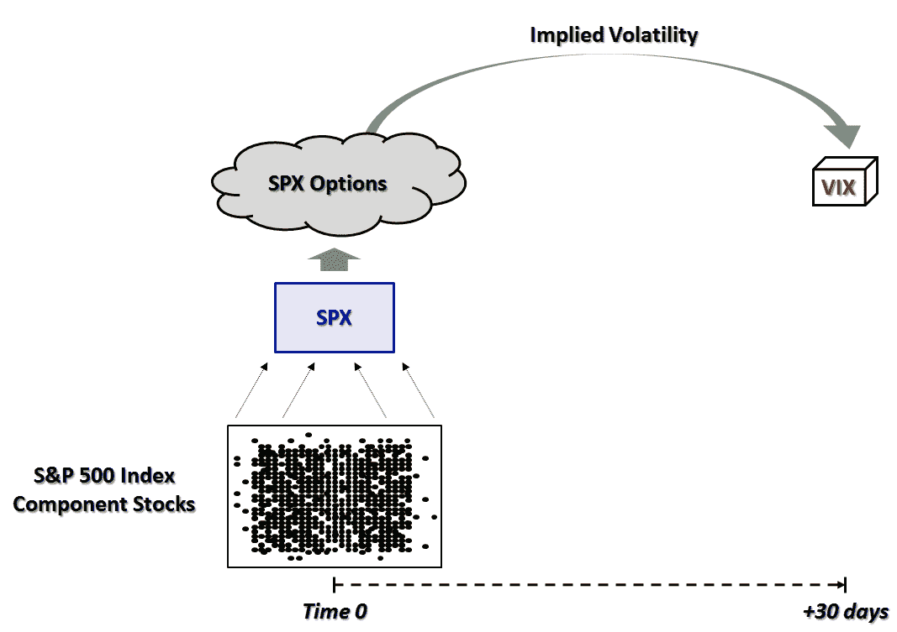

<!--yml

类别：未分类

日期：2024-05-18 17:00:11

-->

# VIX 和更多：VIX 和 VXX：开始时...

> 来源：[`vixandmore.blogspot.com/2010/10/vix-and-vxx-in-beginning.html#0001-01-01`](http://vixandmore.blogspot.com/2010/10/vix-and-vxx-in-beginning.html#0001-01-01)

上周在[你想知道关于 VXX 的什么？](http://vixandmore.blogspot.com/2010/10/what-do-you-want-to-know-about-vxx.html)中，我向读者询问了他们对我预期中将成为有关 iPath S&P 500 VIX 短期期货 ETN（[VXX](http://vixandmore.blogspot.com/search/label/VXX)）的大杂烩文章中涵盖什么的想法。

经过反思我收到的许多周到的电子邮件和评论后，我意识到对这种产品的兴趣范围和困惑足以有理由进行多部分系列报道。 我越想到 VXX 的广泛知识和缺乏知识，我越意识到从头开始给予所有经验水平的投资者以及最近加入博客读者的人以相同的知识和背景基础的机会是有意义的。

因此...自从四年前启动这个博客以来，我将首次从最基本的问题开始：什么是 VIX？

VIX，其正式名称为芝加哥期权交易所波动率指数，是芝加哥期权交易所对标准普尔 500 指数期权的 30 天隐含波动率的市场预期计算。 CBOE 在*指数*交易日内每 15 秒计算并发布 VIX 值，该交易日从东部时间上午 9:30 到下午 4:**15**。 换句话说，VIX 是在正常的纽约证券交易所交易日内计算的，加上正常交易结束后的 15 分钟。

带着一丝幸运，我下面创建的图形简化了如何计算 VIX 的解释。

图形的目的是要说明，在所有交易的股票宇宙中，VIX 仅关注构成标准普尔 500 指数的股票，该指数也被称为其股票代码，即 SPX。 标准普尔 500 指数由一个指数委员会维护（更多细节[在此处](http://www.standardandpoors.com/indices/sp-500/en/us/?indexId=spusa-500-usduf--p-us-l--)，定期更改指数成分。 VIX 是使用近期 SPX 期权（通常是前两个月）和广泛的执行价格（有关计算方法的详细信息，请参见[CBOE 的 VIX 白皮书](http://www.cboe.com/micro/vix/vixwhite.pdf)），并基本上反映了用于计算的这些期权的隐含波动率。

结果是市场对标准普尔 500 指数未来 30 天隐含波动率的估计，以年化形式陈述。 请参阅[16 条规则和 40 个 VIX](http://vixandmore.blogspot.com/2010/05/rule-of-16-and-vix-of-40.html)以更好地了解标准偏差如何纳入 VIX 以及如何解释标准偏差。

在下一部分中，我将从 VIX 跳转到 VXX，但为了做到这一点，我们将不得不熟悉[VIX 期货](http://vixandmore.blogspot.com/search/label/VIX%20futures)。

对于那些对一些额外阅读感兴趣的人来说，下面的链接是一个很好的起点，所有标有“[教育](http://vixandmore.blogspot.com/search/label/educational)”标签的*VIX and More*帖子也是如此。

相关帖子：

**

***披露：*** *写作时做空 VXX*
