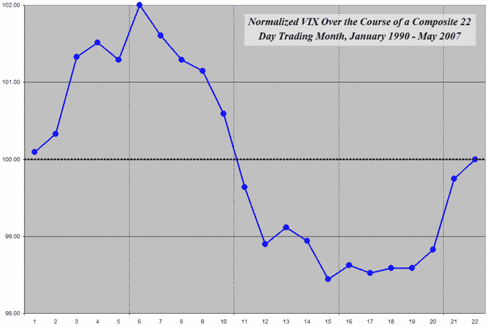

<!--yml

类别：未分类

日期：2024-05-18 19:12:24

-->

# VIX 和更多：VIX 和每月日历

> 来源：[`vixandmore.blogspot.com/2007/06/vix-and-monthly-calendar.html#0001-01-01`](http://vixandmore.blogspot.com/2007/06/vix-and-monthly-calendar.html#0001-01-01)

在博客刚刚开始的时候，当波动性看起来已经消失，没有人关心这个问题时，我在 Excel 中切割和切割了一堆 VIX 数据，试图确定一些影响 VIX 的周期。一些结果尤其引人注目（例如年度周期和 FOMC 周期），而另一些则明显不够启发人。

我从未发布过的一个周期是每月的交易日历。季度周期和期权到期周期有点涉及到每月周期，但我认为现在是更仔细地研究每月周期的时候，而不是在 3 万英尺高空进行插值。

对于那些可能对这些图表不熟悉的人，下面的图表将一个日历月转换为一个 22 个交易日的月份，将 VIX 标准化为 100，然后汇总了从 1990 年到昨天所有交易日的 VIX 收盘值。（我喜欢在这些图表中将 VIX 标准化，因为这样更容易从一个点到另一个点获得透视。）

从

[先前的研究](http://vixandmore.blogspot.com/2007/01/vix-performance-during-options.html)

在期权到期周期上，我对在期权到期前的一周半或左右戏剧性波动的下降并不感到惊讶（平均下来是第 13

^(第)

每个月的交易日。）然而，我惊讶地看到了每个月末波动性的上升，这种波动性倾向于持续到 6

^(第)

每个月的交易日。鉴于市场在每个月末和每个月初的牛市走势的模式已经被许多人如

[股票交易者年鉴](http://www.stocktradersalmanac.com/sta/home.do)

和其他人所记录，我并不指望看到 VIX 倾向于在市场普遍做同样事情的同时上涨。我尚未开发出一个理论来解释这种现象，尽管我确实提出了

[伯尼·谢弗的理论](http://vixandmore.blogspot.com/2007/02/puts-vix-and-intra-month-volatility.html)

几个月前。与往常一样，我鼓励读者提出他们的想法。

最后，对于那些可能对此博客先前提到的其他周期的 VIX 价格变动感兴趣的人，这里有一些链接列表可供查看：

有足够的

[陀螺](http://en.wikipedia.org/wiki/Epicycle)

，也许我最终可以想出一个

[托勒密](http://en.wikipedia.org/wiki/Ptolemy)

VIX 的近似值…

