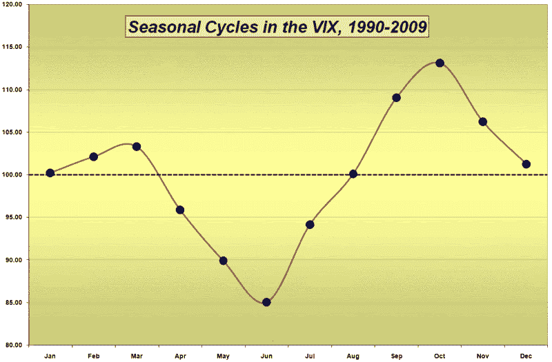

<!--yml

类别：未分类

日期：2024-05-18 17:41:59

-->

# VIX 和更多：VIX 处于季节周期低点

> 来源：[`vixandmore.blogspot.com/2009/06/vix-at-seasonal-cycle-low.html#0001-01-01`](http://vixandmore.blogspot.com/2009/06/vix-at-seasonal-cycle-low.html#0001-01-01)

随着 VIX 现在逐渐舒适地处于 20 几岁，人们对接下来几个月 VIX 可能下跌到多低进行了相当多的讨论。

四月份，在[新的 VIX 宏观周期图景](http://vixandmore.blogspot.com/2009/04/new-vix-macro-cycle-picture.html)中，我预测 VIX 在当前牛市中可能不会跌破 25-27 区域。这个预测目前仍然有效，但在夏季几乎肯定会受到考验。

大多数投资者倾向于将夏季季节视为交易的一种[马拉地带](http://en.wikipedia.org/wiki/Horse_latitudes)，交易量下降，投资组合经理休假，股票有时会处于巡航状态。因此，大多数人将夏季与较低的波动性等同起来。

尽管 VIX 确实倾向于遵循明显的[季节周期](http://vixandmore.blogspot.com/search/label/seasonality)，但事实是，我们现在处于季节周期的低点，历史上从六月到十月的波动性都会急剧增加。事实上，在过去的二十年中，从六月到七月的波动性增加最为显著，增加了超过 10%（1.82 点）。下面的图表显示了从 1990 年 1 月到上个月的组合月波动性，以 100 作为系列均值。

所以...尽管随着一些关于全球经济衰退的担忧在接下来的几个月里得到缓解，波动性可能确实会趋于下降，但较低的波动性将不得不抵消已建立的季节性周期。

欲了解有关同一主题的一些先前文章，请参阅：

*[图形：VIXandMore]*

***披露****：写作时通过期权持有 VIX 的中性仓位*
