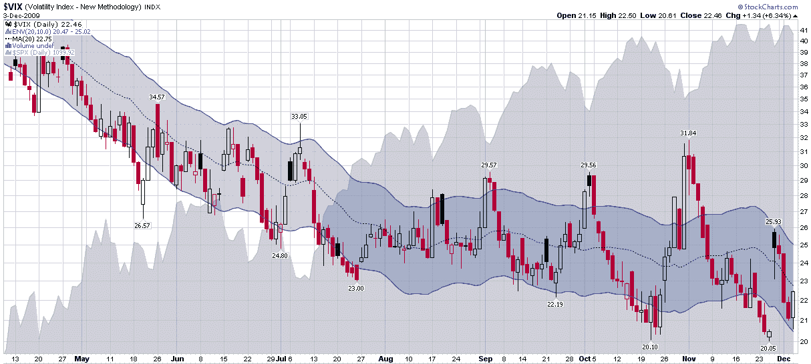

<!--yml

类别：未分类

日期：2024 年 05 月 18 日 17:21:13

-->

# VIX and More：20 的 VIX 引发市场修正？

> 来源：[`vixandmore.blogspot.com/2009/12/vix-of-20-spurring-market-correction.html#0001-01-01`](http://vixandmore.blogspot.com/2009/12/vix-of-20-spurring-market-correction.html#0001-01-01)

正如下图所示，最近两次 VIX 接近 20（十月底和十一月底）时，股票出现了抛售并且波动性飙升的情况。20 的 VIX 可能仍然是投资者尚未准备接受的事物([可得性偏差](http://vixandmore.blogspot.com/search/label/availability%20bias))，但是随着历史波动率在 16 左右徘徊，以及 VIX 的长期趋势仍在向下，很可能在我们看到 19 的 VIX 之前只是时间问题。

除了 VIX 的绝对水平之外，人们还必须时刻关注相对 VIX 水平，这就是[移动平均包络线](http://vixandmore.blogspot.com/search/label/moving%20average%20envelopes)的作用所在。在图表的交易范围中显示为蓝色区域，10 天简单移动平均包络线使得容易识别 VIX 是向高位还是向低位延伸。虽然 VIX 在过去的两次下跌中已经远离了移动平均包络线的范围，但这不太可能是未来的情况。这为未来可能出现的绝对 VIX（20 的支撑）与相对 VIX（包络线底部的支撑）之间的争夺设定了可能性，在未来的某个时候，20 的水平不再保持的可能性增加。

最后，现在是那个时候，我觉得有必要提醒大家，季节性因素也表明波动性应该会降低。我曾在此处多次讨论过[假日效应](http://vixandmore.blogspot.com/search/label/Holiday%20Effect)，基本上历史模式要求 VIX 在十二月的前两周保持相对稳定，然后在圣诞节临近时急剧下降（当前水平大约下降 1.5 个点）。

对于这些主题的更多信息，鼓励读者查看：

*[来源：StockCharts]*

****披露：*** *无**
