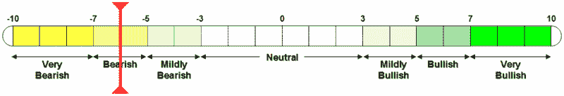

<!--yml

类别：未分类

日期：2024-05-18 18:56:18

-->

# VIX and More: VWSI Drops to -6 as Markets Ponder a U-Turn

> 来源：[`vixandmore.blogspot.com/2007/10/vwsi-drops-to-6-as-markets-ponder-u.html#0001-01-01`](http://vixandmore.blogspot.com/2007/10/vwsi-drops-to-6-as-markets-ponder-u.html#0001-01-01)

上周有四天，VIX 显示出复苏的迹象，周五它咆哮着回归，单日涨幅达到 24.1%，是自 2006 年 5 月以来的第三大单日涨幅。周五的 VIX 暴涨结束了一个周，在这个周里，VIX 上涨了 5.23 点，涨幅为 29.5%，至 22.96。这也恰好是 VIX 一个多月来的最高收盘价。

从周一到周四，VWSI 顽固地保持在零读数，但周五的行动将指标移动到-6，表明在这个阶段，更广泛的市场指数可能已经被过度卖出。

就像我上周所说的那样，我对更广泛的市场比 VWSI 所暗示的更悲观。在我看来，熊市的相关时间框架现在已经延长了：现在不仅需要证明抛售不仅仅是一天的奇迹，现在的任务是连续两个丑陋的周来削弱牛市的势头。明天几乎肯定会开盘下跌，因为周五的持续抛售压力会延续到开盘。问题是卖压是否能够持续，或者是否有足够的买家敢于跳入以缓解卖压。明天的下半场以及周二的所有行动 - 不受政府数据的限制，但仍然受到企业盈利的影响 - 应该对本周的其余时间有很大的影响。牛市可能已经进入尾声，但牛仍然有充分理由继续五年的牛市趋势 - 至少目前是这样。

 *(请注意，在上面的温度计中，“看涨”和“看跌”标签适用于 VIX，而不是更广泛的市场，这些市场通常与 VIX 呈负相关。)*

***搭配葡萄酒：*** 当 VWSI 达到 -6 时，你需要一瓶大酒来平衡它。 我推荐的是宾夕法尼亚酒。 对于那些可能错过的人，除了 *VIX and More*，我偶尔还在 *[Zin and Pinot](http://zinandpinot.blogspot.com/)* 上写博客，这是一个专门介绍我对葡萄酒的热爱的博客 - 也证明了我对宾夕法尼亚酒的偏爱。 由于这是自 2006 年 8 月以来我们第一次达到 VWSI -6，这是在我开始写关于波动性和葡萄园的博客之前 - 我将读者引导至我在 Zin and Pinot 上维护的 [十一位我最喜欢的宾夕法尼亚酒生产商](http://zinandpinot.blogspot.com/) 的一组链接。

在过去的一两周里，我品尝了哈特福德家族酒庄（Hartford Family Winery）的几款 [宾夕法尼亚酒](http://www.hartfordwines.com/wines/zinfandel/)，包括 2003 年的 Highwire Vineyard 和 2004 年的 Dina’s Vineyard。不幸的是，我担心我只剩下最后一瓶了。

2004 Fanucci-Wood RoadVineyard，这可能是我过去几个年份最喜欢的<city st="on"><place st="on">哈特福德</place></city>赤霞珠葡萄酒之一。酿酒师通常偏爱来自年代长达一百年甚至更长的老藤的浓郁果味葡萄酒。在这里也可以期待很高的酒精含量，通常在 16%的范围内（据标签显示，我的酒窖中有一瓶含有 17.1%的酒精），尽管在丝滑的口感中很难辨认出它。
