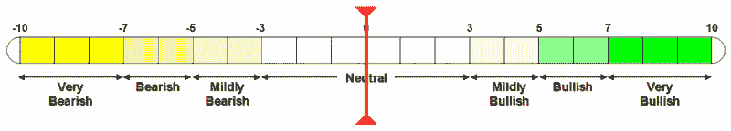

<!--yml

分类：未分类

日期：2024-05-18 15:54:51

-->

# VIX 和 More：VWSI 回调至中性

> 来源：[`vixandmore.blogspot.com/2007/03/vwsi-snaps-back-to-neutral.html#0001-01-01`](http://vixandmore.blogspot.com/2007/03/vwsi-snaps-back-to-neutral.html#0001-01-01)

如果您想在您的投资教材中找到一个例子来说明“VIX 均值回归”，上周将是一个经典案例。在截至 3 月 2 日的那一周，VIX 飙升了 75%，而本周回调了 24%，因此现在它舒适地位于其 10 和 20 日 SMA 之间。

对于一些人来说，这 24%的下跌仍然比 VIX 在 VIX 周情绪指数（VWSI）为-10 时的前三次下跌要小，正如我上周所讨论的那样。然而，这足以使本周的 VWSI 恢复到中性读数零。这大致相当于另一个 VIX 飙升的可能性与接下来一周持续下降的可能性的概率乘以幅度相同。换句话说，VIX 在 3 月 16 日更有可能下跌，*但是* 如果 VIX 在接下来的一周内有显著的波动，那么这种波动更有可能是向上的。

如果您仍然有因为 2/27 之后的 [减弱尖峰策略](http://vixandmore.blogspot.com/2007/02/four-ways-to-play-vix-options-following.html) 而保留的空仓，现在看起来是时候开始获利了。不过，请记住，VIX 在期权到期时有下降的 [倾向](http://vixandmore.blogspot.com/2007/01/vix-performance-during-options.html)。当前总看涨/看跌比率的 10 日 SMA 为 1.28，您可以安全地假设它需要一个 [夏尔巴](http://en.wikipedia.org/wiki/Sherpa) 才能保持在这个高度上，这表明市场有望上涨，而 VIX 本周可能会再次下跌。

（请注意，在上述温度计中，“看涨”和“看跌”标签适用于 VIX，而不适用于更广泛的市场，通常与 VIX 呈负相关。）
