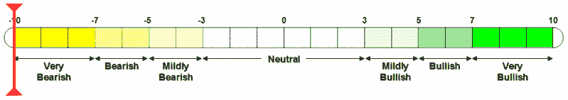

<!--yml

类别：未分类

日期：2024-05-18 15:56:18

-->

# VIX 和更多：VWSI 为 -10

> 来源：[`vixandmore.blogspot.com/2007/03/vwsi-at-10.html#0001-01-01`](http://vixandmore.blogspot.com/2007/03/vwsi-at-10.html#0001-01-01)

随着 VIX 每周情绪指标 (VWSI) 首次自 9/11 以来结束该周为 -10，VIX 在接下来一个月左右的预后是如此悲观。

自 1990 年以来，VWSI 中的当前极端读数仅在三个先前的周内出现过：

+   9/11 后

+   在亚洲金融危机爆发和 97 年 10 月 27 日道琼斯指数下跌 554 点后

+   在 1994 年 3 月，随着第二次联邦基金利率连续两个月的提高，经过五年没有任何联邦基金利率提高的时期

在上述三个实例中，更广泛的市场在危机后至少一年内都表现出相当的动荡和不确定性。

就 VIX 而言，如果以上历史是任何指引，那么可以预期会急剧回归到平均水平。前三次 -10 的 VWSI 读数导致 VIX 的以下变化：

+   3 天：平均-23%（-17%，-24%，-27%）

+   5 天：平均-32%（-27%，-33%，-36%）

+   10 天：平均-33%（-18%，-38%，-42%）

+   20 天：平均-43%（-37%，-46%，-47%）

正如大多数 VIX 均值回归策略一样，这些情况下的大部分收益都限制在前 20 个交易日内。

牢记以上历史，如果预计历史会重演，那么有许多可能的投资方法。做空波动率或做空 VIX 应该是该策略的核心部分。[中性日历价差](http://www.theoptionsguide.com/neutral-calendar-spread.aspx)是一个相对保守的方法；[看跌回购价差](http://www.theoptionsguide.com/put-backspread.aspx)对于激进投资者更合适。那些希望严格限制风险的人应该也在考虑[铁蝴蝶](http://www.theoptionsguide.com/iron-butterfly.aspx)和[铁甲虫](http://www.theoptionsguide.com/iron-condor.aspx)策略。

最后，如果我不提在波动加剧的时期，甚至比更‘正常’的市场更甚的时候，你在进行任何交易之前都应该计划好出场，并明智地使用止损。更好的是，如果你不习惯交易期权，那么现在不是开始尝试的时候。

（请注意，在上述温度计中，“看涨”和“看跌”的标签适用于 VIX，而不是更广泛的市场，通常与 VIX 呈负相关。）
