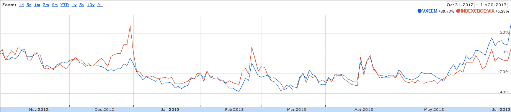

<!--yml

category: 未分类

date: 2024-05-18 16:15:21

-->

# VIX and More: VXEEM as a Measure of Emerging Markets Volatility and Risk

> 来源：[`vixandmore.blogspot.com/2013/06/vxeem-as-measure-of-emerging-markets.html#0001-01-01`](http://vixandmore.blogspot.com/2013/06/vxeem-as-measure-of-emerging-markets.html#0001-01-01)

如果你认为最近美国股票经历了一个艰难时期，那么你还没有关注 [新兴市场](http://vixandmore.blogspot.com/search/label/emerging%20markets) 股票，其中流行的 [EEM](http://vixandmore.blogspot.com/search/label/EEM) 新兴市场 ETF 从 5 月 22 日的 42.96 下跌到今天稍早的 37.02 —— 不到一个月就下跌了 13.8%。问题的很大一部分在于 [BRIC](http://vixandmore.blogspot.com/search/label/BRIC) 国家的表现，其中巴西 ([EWZ](http://vixandmore.blogspot.com/search/label/EWZ))、中国 ([FXI](http://vixandmore.blogspot.com/search/label/FXI)) 和印度 ([EPI](http://vixandmore.blogspot.com/search/label/EPI)) 的表现都像是被人扔下船，脚踝被拴着锚，使得俄罗斯 ([RSX](http://vixandmore.blogspot.com/search/label/RSX)) 看起来是该组中最稳定的投资 —— 这是一个相当艰巨的任务。

想要监控巴西和中国的风险和不确定性的投资者非常幸运，因为他们有专门基于 VIX 方法的 EWZ 和 FXI 的波动率指数。这些波动率指数是由芝加哥期权交易所创建的，分别使用代码 [VXEWZ](http://vixandmore.blogspot.com/search/label/VXEWZ) 和 [VXFXI](http://vixandmore.blogspot.com/search/label/VXFXI)。对于对新兴市场空间的风险和不确定性有更全面的了解，最好的选择可能是 [VXEEM](http://vixandmore.blogspot.com/search/label/VXEEM)，这是芝加哥期权交易所根据 EEM 期权计算的新兴市场 ETF 波动率指数。

下图显示了自 2012 年 10 月底以来 VXEEM 和 VIX 的相对表现。请注意，在 2012 年末期间，围绕着财政自动削减的辩论导致市场对美国股票赋予了比新兴市场股票更多的额外风险和不确定性。在过去的一个月或两个月里，这种关系已经发生了逆转，与 VIX 相比，VXEEM 的风险和不确定性增长速度要快得多。平均而言，VXEEM 的绝对水平约比 VIX 高出约 40%。然而，本周，VXEEM 的水平约比 VIX 高出约 60%。

另外，我发现标普公司[宣布推出](http://www.prnewswire.com/news-releases/sp-emerging-markets-volatility-short-term-futures-index-launched-by-sp-dow-jones-indices-210817371.html)标普新兴市场短期未来波动率指数（S&P Emerging Markets Volatility Short-Term Futures Index）仅仅十天之前。若有了这个指数，就能比较容易地创造基于 VXEEM 而非 VIX 的期货型新兴市场波动率 ETP，其功能类似于[VXX](http://vixandmore.blogspot.com/search/label/VXX)。这类产品的最大障碍可能是[VXEEM 期货](http://vixandmore.blogspot.com/search/label/VXEEM%20futures)市场目前的流动性不足。

*[资料来源：谷歌财经]*

相关文章：

***披露：*** *撰写时做空 VXX*
