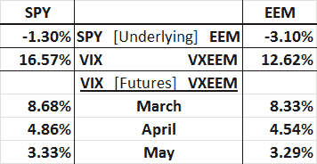

<!--yml

类别：未分类

日期：2024-05-18 16:36:58

-->

# VIX and More: VXEEM vs. VIX Indices and Futures in Today’s Selloff

> 来源：[`vixandmore.blogspot.com/2012/03/vxeem-vs-vix-indices-and-futures-in.html#0001-01-01`](http://vixandmore.blogspot.com/2012/03/vxeem-vs-vix-indices-and-futures-in.html#0001-01-01)

到 2012 年的前十个星期，股市异常平静，迄今为止只有四次 SPX 的 1% 波动，而且全部都是向上的。

恰巧芝加哥期权交易所推出了关于 CBOE 新兴市场 ETF 波动率指数（[VXEEM](http://vixandmore.blogspot.com/search/label/VXEEM)）期货和期权，与这段低迷的波动率重合，这使得这个指数更容易被忽视。

今天是我第一次能够获取[VXEEM 期货](http://vixandmore.blogspot.com/search/label/VXEEM%20futures)数据的时候，市场下跌至少 1%，我必须承认对结果有些意外。

下表在左列捕捉了 SPY 和 VIX 数据，右列捕捉了 EEM 和 VXEEM 数据。请注意，在今天的常规交易会话进行约一小时后，SPY 下跌约 1.3%，而流行的[新兴市场](http://vixandmore.blogspot.com/search/label/emerging%20markets)ETF EEM 下跌 3.1%。到目前为止，一切都还好。更加有趣的是，虽然 EEM 的下跌约为 SPY 的 2.4 倍，但 VIX 比 VXEEM 指数上涨要多得多，分别为 16.57% 和 12.62%……所以虽然抛售的比重在新兴市场，但恐慌在标普 500 指数中的比重却更大。

我还同时获取了三月、四月和五月的[VIX 期货](http://vixandmore.blogspot.com/search/label/VIX%20futures)和 VXEEM 期货数据。有趣的是，VIX 和 VXEEM 前三个月期货的变动几乎完全相同。

我们所处的波动环境到底是怎样的，以至于新兴市场指数下跌速度比 SPX 更快（即使进行了 beta 调整，但这个讨论留待另一天），而 VIX 的波动要比 VXEEM 大得多，但两种产品的期货似乎以几乎相同的方式运动？

如果你认为你有答案，使用 VIX 产品和 VXEEM 期货和期权进行配对交易的机会确实存在（尚无基于 VXEEM 的交易所交易产品）。虽然 VXEEM 期货和期权目前并不特别流动或深度，但它们的流动性和深度足以从中获利。

相关帖子：

**

*[来源：Interactive Brokers]*

****披露：*** *撰写时持有 EEM 多头；芝加哥期权交易所是 VIX and More 的广告客户**
