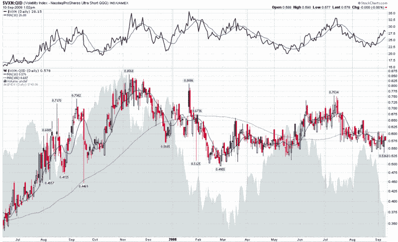

<!--yml

category: 未分类

日期：2024-05-18 18:27:26

-->

# VIX and More：VXN:QID 比率反映了不寻常的自满

> 来源：[`vixandmore.blogspot.com/2008/09/vxnqid-ratio-reflects-unusual.html#0001-01-01`](http://vixandmore.blogspot.com/2008/09/vxnqid-ratio-reflects-unusual.html#0001-01-01)

随着房利美/房地美的救助并未获得更好的评价，英国、德国和西班牙显然正在走向衰退，以及新兴市场持续动荡，有时我会惊讶地看到屏幕上有任何绿色。

另一方面，我相信有些人会想知道如果 VIX 在 24 左右交易，世界金融体系会有多接近崩溃。

这是一个合理的问题——我以前在博客上已经解决过这个问题，借助了几个指标，帮助评估市场上的自满程度。其中之一是“[恐慌图](http://vixandmore.blogspot.com/search/label/fearogram)”，它衡量了 VIX 变化与 SPX 变化的比率。类似的工具是 [VIX:SDS 比率](http://vixandmore.blogspot.com/search/label/VIX%3ASDS)，它比较了 VIX 和 [SDS](http://vixandmore.blogspot.com/search/label/SDS)（SPX 的双向反向 ETF）的相对运动与历史模式。

下面我创建了一个 VXN:QID 比率的图表，这是 VIX:SDS 比率的姐妹。该图表比较了纳斯达克 100 指数（NDX）的波动性与 NDX 的双向反向 ETF 的波动性。这张图表中有（至少）三种思考此图表中自满的方式：

1.  比率的绝对水平

1.  相对于 10 天简单移动平均线的比率水平

1.  相对于 100 天简单移动平均线的比率水平

看着图表，考虑到较低的读数通常对应着较低的自满水平（即，单位下降的波动性和恐惧）。当前比率在绝对尺度上是适度低的，但在 10 天和 100 天 SMA 之间巧妙地安置。我特别感兴趣的是，在那些 [VXN](http://vixandmore.blogspot.com/search/label/VXN) 经历了数周或更长时间的持续上升的情况下（见图上部分），当前情况是比率*不*与 VXN 同步上升的第一次。这个发展是一个值得关注的分歧，似乎有利于空头。

[来源：StockCharts, VIX and More]

感谢所有回应我的请求以帮助创建 Word 中的博客帖子并将其发布到 Blogger 的人。就记录而言，这是我使用 [Windows Live Writer](http://get.live.com/writer/overview) 发布的第一篇帖子，到目前为止它做得很好...
