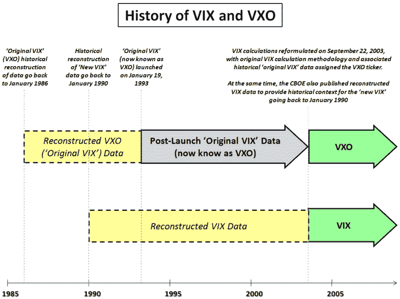
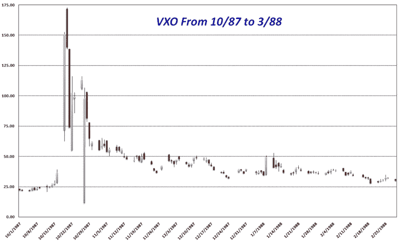

<!--yml

category: 未分类

date: 2024-05-18 18:23:27

-->

# VIX 和 More: 1987-1988 年 VXO 图表及 VIX 与 VXO 的解释

> 来源：[`vixandmore.blogspot.com/2008/10/vxo-chart-from-1987-1988-and.html#0001-01-01`](http://vixandmore.blogspot.com/2008/10/vxo-chart-from-1987-1988-and.html#0001-01-01)

过去，我曾经费了一些口舌来区分 VIX 和[VXO](http://vixandmore.blogspot.com/search/label/VXO)，但考虑到我在媒体上看到的有关新 VIX 纪录的混淆，我认为现在是提供一些可能有助于澄清情况的历史的时候了。

说实话，开始的好地方是我之前发表的一篇题为[每个人都应该了解的 VIX 十件事](http://vixandmore.blogspot.com/2008/04/ten-things-everyone-should-know-about.html)的帖子。对于视觉学习者，我已经将 VIX 和 VXO 的历史简化为下面的时间轴图。以下是一些要点：

+   VIX 于 1993 年推出

+   2003 年 9 月，用于计算 VIX 的公式被大幅修改

+   来自新的 2003 年 VIX 公式的数据被分配了 VIX 股票代码，但芝加哥期权交易所公布了新 VIX 配方的历史数据重建，追溯至 1990 年

+   与“原始 VIX”公式相关的数据（历史和随后的数据）同时被分配了新的 VXO 股票代码

结果就是，对于您或您的数据提供商而言，提及 VIX 时实际上指的是新的 2003 年 VIX 计算以及对新 VIX 公式的数据进行的历史重建。同样，VXO 股票代码指的是从 2003 年到现在的 VXO 数据，从 1993 年到 2003 年的“原始 VIX”数据，以及回溯到 1986 年的“原始 VIX”数据的历史重建。

[来源: VIX and More]

因此，在记录方面，[1987 年](http://vixandmore.blogspot.com/search/label/1987)没有 VIX 或 VXO，但是 VXO 的历史重建表明，1987 年 10 月 19 日“黑色星期一”的日内最高点为 152.48，收盘价为 150.19，并且 1987 年 10 月 20 日的日内最高 VXO 为 172.79。下面的图表详细介绍了 1987 年 10 月至 1988 年 3 月期间 VXO 的历史重建情况，当时 VXO 最终跌至 30 以下。

[来源: 雅虎，VIX and More]
