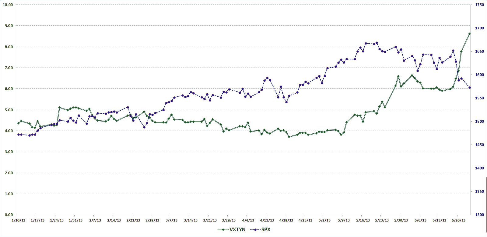
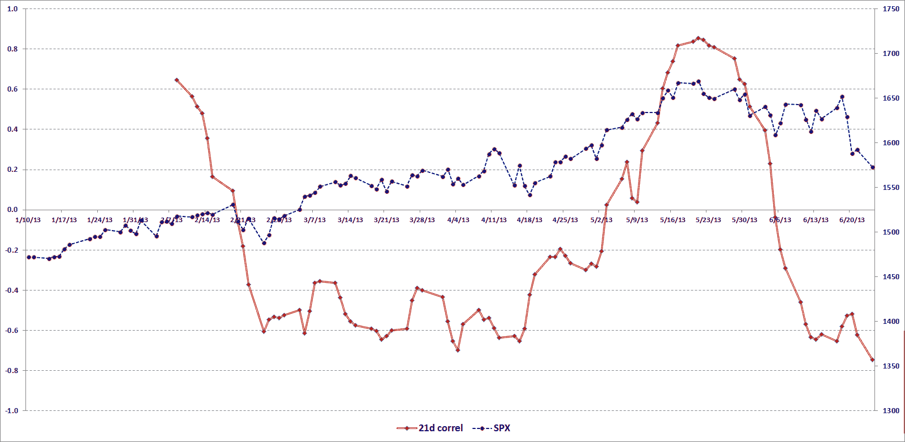

<!--yml

类别：未分类

时间：2024 年 05 月 18 日 16 时 14 分 57 秒

-->

# VIX 和更多信息：VXTYN 衡量美国国债的波动性和潜在溢出效应

> 来源：[`vixandmore.blogspot.com/2013/06/vxtyn-measures-volatility-in-us.html#0001-01-01`](http://vixandmore.blogspot.com/2013/06/vxtyn-measures-volatility-in-us.html#0001-01-01)

最近，我一直在强调金融市场上一些非传统的波动性和风险指标，包括[VXEEM](http://vixandmore.blogspot.com/search/label/VXEEM)（CBOE 新兴市场 ETF 波动率指数）；[DXJ](http://vixandmore.blogspot.com/search/label/DXJ)（WisdomTree 日本对冲股票基金）；和[DBV](http://vixandmore.blogspot.com/search/label/DBV)（PowerShares DB G10 货币收获基金）。我关注这些在很大程度上不为人所注意的指数和交易所交易产品的一部分原因是希望更多的投资者从地理和资产类别的更广泛范围来思考风险。

甚至那些顽固地以股票为中心的投资者（我知道你们比你们愿意承认的要多）也应该密切关注的一种资产类别是美国国债。当然，美国国债有很多种类，但最重要的可能是[美国 10 年期国债](http://vixandmore.blogspot.com/search/label/10%20Year%20Treasury%20Note)。在展示出完美的时机的同时，上个月 CBOE 和 CFE 合作推出了一个基于这种证券的新波动率指数：CBOE/CBOT 10 年期美国国债波动率指数（[VXTYN](http://vixandmore.blogspot.com/search/label/VXTNY)）。

在下面的图表中，我展示了 VXTYN 和 SPX 的路径，回溯到 2013 年 1 月 10 日，这是 CBOE 提供的 VXTYN 历史数据的开始。请注意，VXTYN 仅从 5 月份开始上升，并且在上升幅度较大时，股票价格会下降。

*[来源：CBOE，Yahoo，VIX and More]*

仅供娱乐，我还包括了一个图表，显示了 VXTYN 与 SPX 之间相关性的 21 天滚动平均值。在这里，相关性波动与股票后续走势之间的关系可能更容易可视化。由于历史数据不足一个月，我建议不要过早下结论关于相关性和因果关系，但至少我认为这张图可能会提供一些思考的食物。

*[来源：CBOE，Yahoo，VIX and More]*

最后但同样重要的是：你知道是否有 ETPs 可以下注国债收益率曲线是会变陡还是会变平吗？我在 2010 年的[《国债收益率曲线 ETNs 和波动性》](http://vixandmore.blogspot.com/2010/12/treasury-yield-curve-etfs-and.html)中强调了这些产品；它们正式被称为 iPath 美国国债加剧器 ETN（[STPP](http://vixandmore.blogspot.com/search/label/STPP)）和 iPath 美国国债平缓器 ETN（[FLAT](http://vixandmore.blogspot.com/search/label/FLAT)）。

相关帖子：

***披露：*** *在写作时长期持有 DXJ；芝加哥期权交易所是 VIX 和 More 的广告客户*
