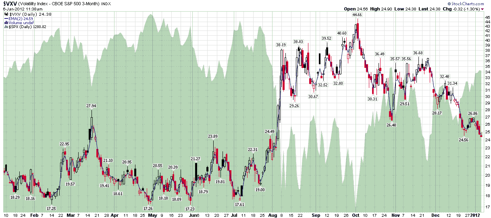

<!--yml

类别：未分类

日期：2024-05-18 16:44:00

-->

# VIX and More: VXV 预示着回归正常状态

> 来源：[`vixandmore.blogspot.com/2012/01/vxv-heralding-return-to-normalcy.html#0001-01-01`](http://vixandmore.blogspot.com/2012/01/vxv-heralding-return-to-normalcy.html#0001-01-01)

随着政治季节的升温，现在似乎是时机适合再次在我的文章中加入“[正常](http://en.wikipedia.org/wiki/Normalcy)”一词了，并且还有比把我最喜欢的被忽视的指数之一——[芝加哥期权交易所标普 500 3 个月波动率指数](http://www.cboe.com/micro/vxv/)（通常用更简洁的 [VXV](http://vixandmore.blogspot.com/search/label/VXV) 代码）——放在显微镜下的更好方法吗？

对于不熟悉 VXV 的人，我相当确定我是第一个在 2007 年讨论这个指数的人，讨论 [VIX:VXV 比率](http://vixandmore.blogspot.com/search/label/VIX%3AVXV)（这是一个没有 [VIX 期货](http://vixandmore.blogspot.com/search/label/VIX%20futures) 行情的人们了解 VIX 期货 [期限结构](http://vixandmore.blogspot.com/search/label/term%20structure) 的好方法），并且把整个巴伦专栏都献给了这个主题（[对波动性有一个更长期的视角](http://online.barrons.com/article/SB124648899704482887.html)）并推广 VXV 作为长期和 [结构性/系统性波动性](http://vixandmore.blogspot.com/search/label/structural%20volatility) 的更好反映，而 VIX 更适合衡量短期 [事件波动性](http://vixandmore.blogspot.com/search/label/event%20volatility)。

对于那些希望了解一些额外背景和上下文的人，关于这个主题的以前的文章有很多，下面的链接应该提供一些很好的起点。

回到 VXV，我认为值得注意的是，虽然 VIX 仍高于去年 12 月的最低点，但 VXV 已经跌破了这些最低点，并且降到了自去年 8 月初以来没有见过的水平——而且由于 VXV 是对结构性和系统性风险的更好衡量（更不用说基本上不受 [节假日效应](http://vixandmore.blogspot.com/search/label/Holiday%20Effect) 的影响了），我认为这是一个值得关注的重要发展。

坦率地说，VXV 图表看起来很像 2009 年 4 月初的情况，当时我写了一篇名为 [每周图表：VXV 和系统性失败](http://vixandmore.blogspot.com/2009/04/chart-of-week-vxv-and-systemic-failure.html) 的文章。当时我得出结论说：“关键要点：系统性痊愈正在继续，系统性失败的风险正在减少。”根据 VXV 图表，现在看来我们正处于一个类似的时刻。

相关文章：

**

*[来源：StockCharts.com]*

***披露：*** *芝加哥期权交易所是《VIX 与更多》的广告商*
