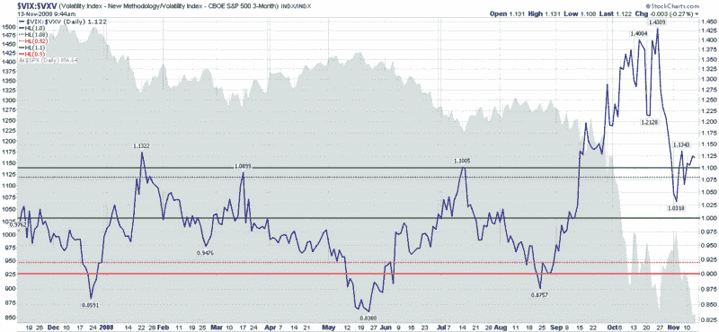

<!--yml

分类：未分类

日期：2024-05-18 18:16:27

-->

# VIX 和更多：VXV 一岁啦

> 来源：[`vixandmore.blogspot.com/2008/11/vxv-is-one-year-old.html#0001-01-01`](http://vixandmore.blogspot.com/2008/11/vxv-is-one-year-old.html#0001-01-01)

一年前，芝加哥期权交易所推出了[VXV](http://vixandmore.blogspot.com/search/label/VXV)，这是 VIX 的一个变体，它计算了 SPX 期权的隐含波动率，而不是 VIX 使用的 30 天时间窗口。

在 2007 年 12 月，VXV 刚刚诞生不到一个月的时候，我冒了风险，在[VIX:VXV Ratio](http://vixandmore.blogspot.com/2007/12/vixvxv-ratio.html)中提出，比较 VIX 和 VXV 的相对水平可能会成为一个重要的市场定时信号，类似于[VIX term structure](http://vixandmore.blogspot.com/search/label/term%20structure)数据。

令我非常高兴的是，从 2007 年 11 月到雷曼兄弟公司于 2008 年 9 月破产期间，[VIX:VXV 比率](http://vixandmore.blogspot.com/search/label/VIX%3AVXV)表现得几乎完美，产生了及时的买入和卖出信号。然而，在后雷曼时代，由于市场走低，VIX:VXV 比率一直面临着多头偏向的困境。

在下图中，我展示了我在 2007 年 12 月对 VIX:VXV 如何应用的最初想法。自那时起，我已经对我的个人使用进行了一些增强，但我还没有在博客上发布。其中一些增强现在表明，像 1.10 和 0.90 这样的雷曼前阈值水平再次具有相关性。这将使当前的 VIX:VXV 比率为 1.12 的情况成为一个绝佳的购买机会。

长期以来，我是唯一一个谈论 VIX:VXV 比率的人。然而，在过去的一年里，它已经拥有了强大的追随者。现在读者已经有一年的数据可以消化，并且有广泛的市场条件可以评估该指标，在 VIX:VXV 比率方面，你会建议做出哪些改进或修改呢？请在下面的评论部分自由讨论。

来源：[StockCharts]
