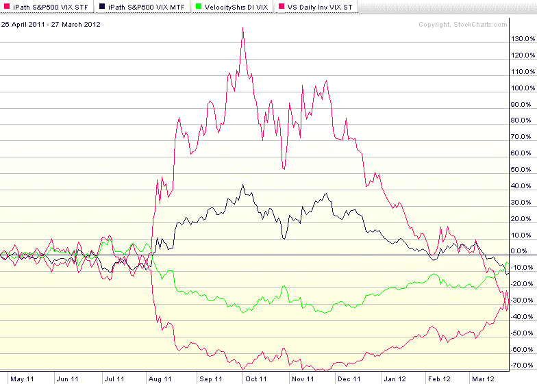

<!--yml

分类：未分类

日期：2024-05-18 16:34:46

-->

# VIX and More：在 VIX 近乎横盘的十一个月里，VXX、VXZ、XIV 和 ZIV 的表现

> 来源：[`vixandmore.blogspot.com/2012/03/vxx-vxz-xiv-and-ziv-during-eleven.html#0001-01-01`](http://vixandmore.blogspot.com/2012/03/vxx-vxz-xiv-and-ziv-during-eleven.html#0001-01-01)

今天，VIX 收盘为 15.59，仅比 2011 年 4 月 26 日的 15.62 收盘价低了 0.03 点，大约是十一个月前。

从长期来看，VIX 没有发生太多变化，但对于那些曾经经历过波动率过山车般的上下起伏的人来说，现在似乎是一个很好的机会，可以反思这段旅程带给我们的东西。

对于那些在过去十一个月内交易过 [VIX 交易产品](http://vixandmore.blogspot.com/search/label/VIX%20ETN)（ETP）的人来说，这段旅程与 VIX 本身的表现大不相同，我在 [2011 年 VIX 交易产品年度回顾](http://vixandmore.blogspot.com/2011/12/vix-exchange-traded-products-year-in.html) 中强调了这一问题，当时我得出结论：“尽管有趣的是，长期和短期波动率 ETP 都无法在这一年中盈利，但在 2011 年的某些时期，各种 VIX ETP 都取得了非凡的收益。”

在下图中，我突出显示了四种受欢迎的 VIX ETP 的表现，这些产品是在竞争激烈的市场中最活跃交易的产品之一，具有相似的杠杆系数和加权平均到期日（有关更多细节，请参阅 [切片和切块所有 31 种 VIX ETP](http://vixandmore.blogspot.com/2011/11/ten-months-have-passed-since-last-time.html)）：

+   [VXX](http://vixandmore.blogspot.com/search/label/VXX) – iPath 标普 500 VIX 短期期货 ETN（红线）

+   [VXZ](http://vixandmore.blogspot.com/search/label/VXZ) – iPath 标普 500 VIX 中期期货 ETN（蓝线）

+   [ZIV](http://vixandmore.blogspot.com/search/label/ZIV) – VelocityShares 每日反向 VIX 中期 ETN（绿线）

+   [XIV](http://vixandmore.blogspot.com/search/label/XIV) – VelocityShares 每日反向 VIX 短期 ETN（紫线）

注意，尽管 VIX 呈横盘状态，但所有四种 VIX ETP 都亏损了，其中最严重的亏损发生在 VXX 上，这段时期亏损了 28%。

毫不奇怪，两个具有五个月目标到期日的 ETP（VXZ 和 ZIV）的波动性明显低于它们一个月目标到期日的对应产品。

这里有很多潜在的启示，但也许最重要的是，长期时间跨度内，VIX ETP 很难超越 VIX。要使这些交易盈利，关键在于正确把握市场时机，以及在交易开始朝着错误

相关帖子：

**

*[来源：StockCharts.com]*

***披露：*** *在撰写本文时，持有 XIV 和 ZIV 多头仓位，持有 VXX 和 VXZ 空头仓位*
