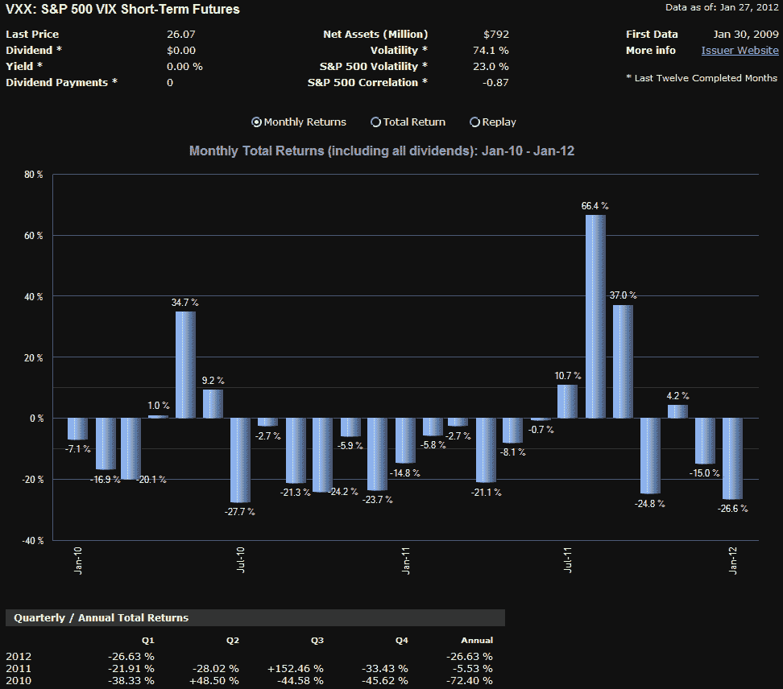

<!--yml

类别：未分类

日期：2024 年 5 月 18 日 16:42:15

-->

# VIX and More：VXX 庆祝第三个生日

> 来源：[`vixandmore.blogspot.com/2012/01/vxx-celebrates-third-birthday.html#0001-01-01`](http://vixandmore.blogspot.com/2012/01/vxx-celebrates-third-birthday.html#0001-01-01)

似乎不久之前我是唯一一个认为值得提及[VXX](http://vixandmore.blogspot.com/search/label/VXX)的人。

正式称为 iPath S&P 500 VIX 短期期货 ETN，VXX 是在三年前的今天推出的，与其同胞 iPath S&P 500 VIX 中期期货 ETN，[VXZ](http://vixandmore.blogspot.com/search/label/VXZ)一起。这些是第一批 VIX 基础的交易所交易产品登陆市场。

在这个空间中，我详细讨论了影响 VXX 表现的因素（[VIX 期货](http://vixandmore.blogspot.com/search/label/VIX%20futures)、[正溢价](http://vixandmore.blogspot.com/search/label/contango)、[卷取收益](http://vixandmore.blogspot.com/search/label/roll%20yield)等）以及 VXX 持续表现不佳的根本原因。

为了使会计工作及时更新，VXX 在第一年下跌了 68.4%，然后在第二年损失了 74.6%。在第三个交易年中，VXX 的表现要好得多，但仍然下跌了 18.6%。当然也有出色表现的时候（特别是 8 月份的 66.4%飙升，如下图所示），但在整个一年的过程中，卷取收益的拖累超过了波动率飙升所能克服的。事实上，VXX 现在比其分拆调整后的发行价跌了 94%。

即使有以上事实，仍然有可能从 VXX 的多头成功交易，特别是如果保持持有期尽可能短，和/或密切关注 VIX 期货[期限结构](http://vixandmore.blogspot.com/search/label/term%20structurehttp:/vixandmore.blogspot.com/search/label/term%20structure)。

相关帖子：

**

*[来源：ETFreplay.com]*

****披露：*** *撰写时做空 VXX**
