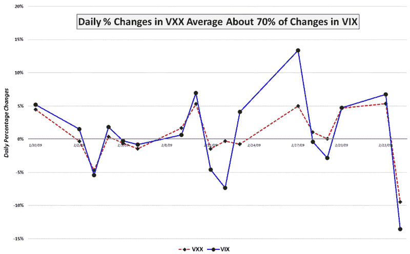

<!--yml

类别: 未分类

日期: 2024-05-18 17:58:06

-->

# VIX 和更多：VXX 涨跌幅度及其投资组合保险影响

> 来源：[`vixandmore.blogspot.com/2009/02/vxx-juice-factor-and-portfolio.html#0001-01-01`](http://vixandmore.blogspot.com/2009/02/vxx-juice-factor-and-portfolio.html#0001-01-01)

尽管我持续收到关于[VXX](http://vixandmore.blogspot.com/search/label/VXX)的许多问题，这个新的[VIX ETN](http://vixandmore.blogspot.com/search/label/VIX%20ETN)，但我注意到交易量似乎已经稳定在每天大约 100,000 股的水平上。也许在早期阶段，人们对这个产品的兴趣将更多地是学术性的，而交易和套保策略在更好地发展之前。

无论如何，围绕 VXX 的一个关键问题与我所称的[VXX 涨跌幅度](http://vixandmore.blogspot.com/search/label/VXX%20juice%20factor)有关。简而言之，问题是围绕着长期持有 VXX 的什么样的变动可以期待与 VIX 的关系。从另一个角度来看待同样的问题是，如何表达 VXX 在 SPX 朝相反方向变动时会移动多少。

上个星期五，在[VXX Tracking VIX at 80+% Today](http://vixandmore.blogspot.com/2009/02/vxx-tracking-vix-at-80-today.html)中，我试图根据历史数据回答了这些问题中的第一个。今天我将尝试回答这两个问题，使用 VXX 自启动以来的头 17 天的数据，并借助下面的图表。

在它交易的头 17 天中，我展示了 VXX 的涨跌幅度接近 70%，这意味着，平均而言，对于 VIX 的每 1%的变动，VXX 大约会变动约 0.7%。不幸的是，当 VIX 有大幅度变动时，这通常是 VXX 的涨跌幅度最小的时候，就像 2 月 12 日和 2 月 17 日的背离所展示的那样。

在这个阶段，我的工作假设是，当你根本不需要它时，VXX 提供了最多的投资组合保险，并且在你最需要它时效果最差。

我将在以后更详细地解决这个问题，并为这个主题提供更多数据。

*[来源: VIXandMore]*
