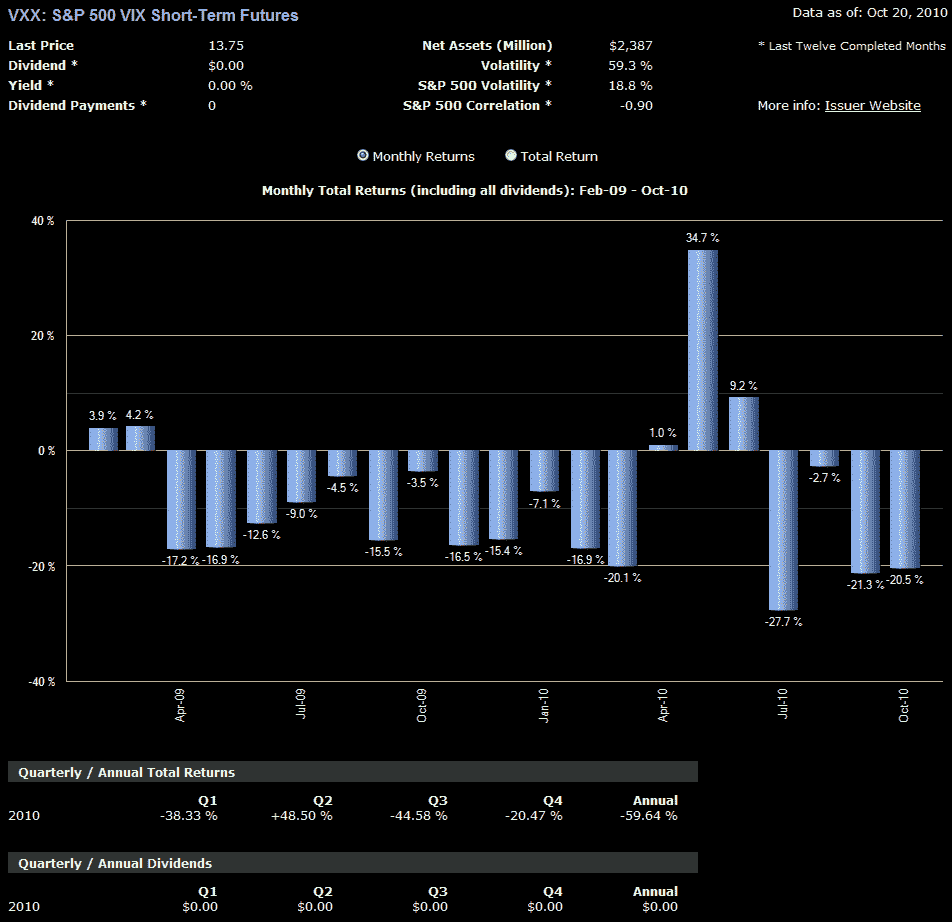

<!--yml

类别：未分类

日期：2024 年 05 月 18 日 17:00:36

-->

# VIX 和更多信息：VXX 月度表现

> 来源：[`vixandmore.blogspot.com/2010/10/vxx-monthly-performance.html#0001-01-01`](http://vixandmore.blogspot.com/2010/10/vxx-monthly-performance.html#0001-01-01)

昨天我在[你想了解关于 VXX 的什么？](http://vixandmore.blogspot.com/2010/10/what-do-you-want-to-know-about-vxx.html)中寻求了一些意见，并且很高兴看到了所有的评论和电子邮件。反思这种情况，由于我在过去一个月或两个月里收到了几乎*数百*有关 VXX 的问题，我决定从下周开始进行有关[VXX](http://vixandmore.blogspot.com/search/label/VXX)的多部分系列文章，而不是尝试另一篇“每个人都应该知道的十件事……”的帖子，就像我在[每个人都应该知道的有关 VIX 的十件事](http://vixandmore.blogspot.com/2008/04/ten-things-everyone-should-know-about.html)中所做的那样。坦率地说，仅限制自己到十个事实/问题/误解是不可能充分展现 VXX 的，而这一次我将比我对 VIX 所做的更深入地探讨。

话虽如此，我觉得在本周结束之前应该给读者一些东西，因此在此附上了一张从这个 ETN 发行以来 VXX 月度表现的图表。图表以月度形式呈现了 VXX 的难题，但无论是哪个时间范围，问题都是相似的：您想要采取一个成功概率低但潜在奖励高的长期持仓吗？当然，持有期越长，[升水](http://vixandmore.blogspot.com/search/label/contango)会降低成功的概率，但投资者会更有机会抓住像五月份那样的波动大幅度上涨。

在某些方面，长期持有 VXX 位置类似于长期持有平价期权位置。

再次强调，如果您对 VXX 有具体问题，请随时将其添加到下面第一个链接中的评论部分，我会尽量将其纳入下周的系列中。

相关文章：

*[来源：ETFreplay.com]*

***披露：*** *在撰写本文时空仓 VXX*
