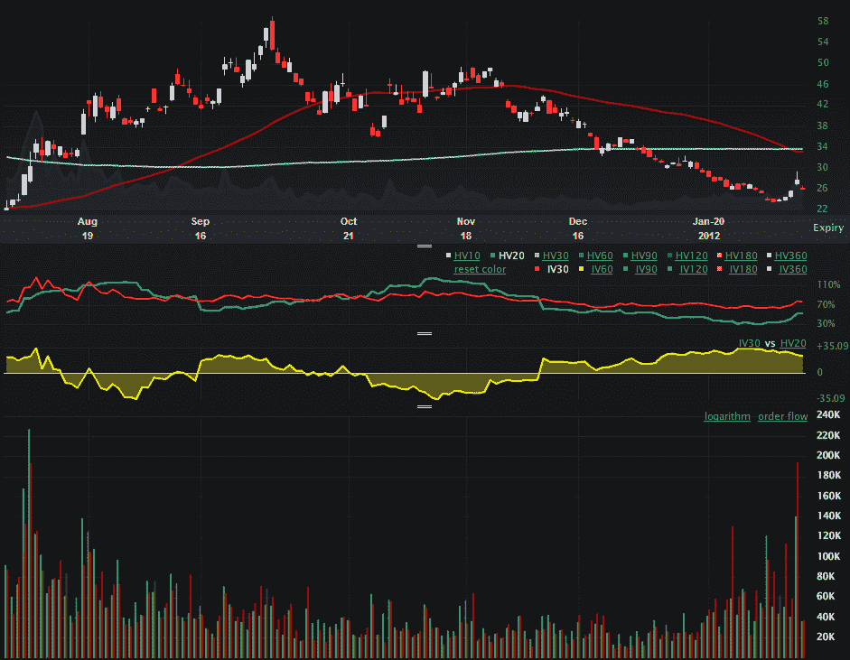

<!--yml

category: 未分类

日期：2024-05-18 16:40:22

-->

# VIX and More：VXX 期权在历史上第二高交易量日后保持平稳

> 来源：[`vixandmore.blogspot.com/2012/02/vxx-options-calm-after-second-highest.html#0001-01-01`](http://vixandmore.blogspot.com/2012/02/vxx-options-calm-after-second-highest.html#0001-01-01)

[VXX](http://vixandmore.blogspot.com/search/label/VXX)期权交易量（iPath S&P 500 VIX 短期期货 ETN）于周五激增至历史上第二高水平，共有 344,777 份合约交易，而看跌期权（56%）的交易量远远超过看涨期权（44%）。

下图显示了自 2011 年 8 月初以来 VXX 期权的交易活动情况。请注意，VXX 的记录期权交易量始于 8 月 5 日，正好在 VXX 从 30 上涨到 50 多之前发生。在那一天以及 VXX 期权的其他高交易量日，看涨期权（图表底部的绿色垂直条）的交易活动比看跌期权（红色条）多，因为投资者很可能在押注波动性增加，或对这种可能的情况进行套期保值。

周五的交易量是不寻常的，就像 1 月 26 日一样，看跌期权的交易量占主导地位。总的来说，交易者通常会买入和卖出更多的 VXX 看涨期权而不是看跌期权。在今天的交易中，到目前为止，VXX 期权的交易量远低于周五，看涨期权和看跌期权的活动相对平稳。

这并不是说 VXX 期权投资者特别精明，不应被视为反向情绪指标。相反，我只是建议周五的 VIX 暴涨没有引发恐慌。

实际上，我听说的谣言（通过博客评论者）最有道理的是，有人持有[VIX 期货](http://vixandmore.blogspot.com/search/label/VIX%20futures)，SPX[straddles](http://vixandmore.blogspot.com/search/label/straddle)以及[TVIX](http://vixandmore.blogspot.com/search/label/TVIX)ETP（据说 TVIX 开放利益的 90%）的头寸被一个结算所清算了，一些得知此事的银行能够提前预知此举动。对此要保持怀疑态度，但这种情况很符合我所看到的情况和我们所知的事实。

最后，请记住，2 月份的 VIX 期货和期权将在周三开盘时到期。2 月份的[VIX 期权](http://vixandmore.blogspot.com/search/label/VIX%20options)将在明天最后交易，而 2 月份的 VIX 期货将在周三的盘前交易时段，从东部时间上午 8:00 到 9:15。

相关文章：

**

*[来源：LivevolPro.com]*

***披露：*** *撰文时持有 VXX 和 TVIX 的空头头寸；Livevol 是 VIX and More 的广告客户*
