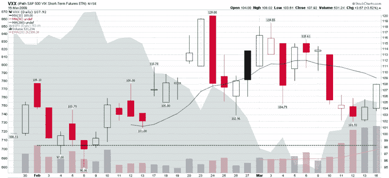

<!--yml

类别：未分类

日期：2024-05-18 17:55:11

-->

# VIX and More：VXX 连续第四天创下新的成交量纪录

> 来源：[`vixandmore.blogspot.com/2009/03/vxx-sets-new-volume-record-for-fourth.html#0001-01-01`](http://vixandmore.blogspot.com/2009/03/vxx-sets-new-volume-record-for-fourth.html#0001-01-01)

当[VXX](http://vixandmore.blogspot.com/search/label/VXX)首次推出时，这只短期（一个月）[VIX ETN](http://vixandmore.blogspot.com/search/label/VIX%20ETN)立即取得了成功，至少从交易量来看是如此，前八个交易日的交易量都超过了 10 万。对 VXX 的兴趣似乎在一段时间内消退，然后突然在上周三激增，正如我在[VXX 创下新的成交量纪录](http://vixandmore.blogspot.com/2009/03/vxx-sets-new-volume-record.html)中报道的那样。

自上周三以来，VXX 的成交量一直在增加。在今天的 531,234 股交易后，VXX 现在可以声称连续四天创下新的成交量纪录，超过了第二个交易日建立的旧纪录（虚线绿线）。

在上周三创下历史性的交易量之后，我发表了以下意见：

> *“我怀疑 VXX 的交易量会随着时间的推移证明是一个有意义的情绪指标。成交量高潮应该能够提供一些关于零售交易者思维方式的见解，并在情绪极端时提供一些反向信号。”*

我无法知道最近成交量激增是否是由于增加的对冲活动造成的空头方向操作（即看跌股票，看涨波动性）。我的直觉仍然是，VXX 交易的大部分主要是方向性投机，并可能提供反向信号。再次说一遍，VXX 交易者最终可能证明是聪明的资金群体的一部分。

我将密切关注这个故事，并在适当时提供额外的更新。

*[来源：StockCharts]*
