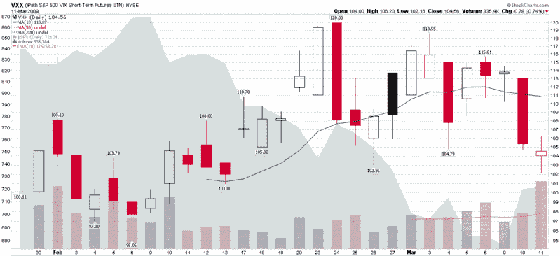

<!--yml

category: 未分类

date: 2024-05-18 17:56:00

-->

# VIX and More: VXX Sets New Volume Record

> 来源：[`vixandmore.blogspot.com/2009/03/vxx-sets-new-volume-record.html#0001-01-01`](http://vixandmore.blogspot.com/2009/03/vxx-sets-new-volume-record.html#0001-01-01)

[VXX](http://vixandmore.blogspot.com/search/label/VXX)，于一月底推出的[VIX ETN](http://vixandmore.blogspot.com/search/label/VIX%20ETN)，昨天创下了新的成交量记录，共交易了 336,384 股。这打破了二月初交易第二天创下的先前记录。

尽管从数据上看还为时过早，但我怀疑 VXX 的交易量将随着时间的推移证明是一个有意义的情绪指标。交易量的高潮应该能够揭示零售交易者的心态，并在情绪极端时提供一些反向信号。

尽管如此，我对昨天创下的新 VXX 交易量记录有些惊讶。由于我使用的经纪商不允许以保证金交易 VXX，因此不允许做空 VXX，我得出结论，昨天的交易量记录很可能是那些认为最近的小反弹以及对波动性死亡的讨论为时过早的人的投机活动。

敬请关注以获取更多关于这个话题的信息...

*[来源：StockCharts]*
