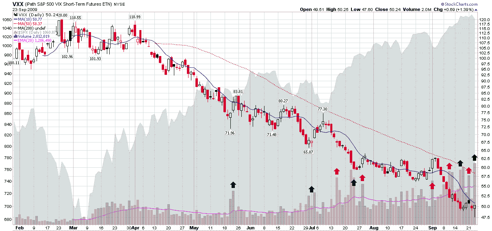

<!--yml

category: 未分类

date: 2024-05-18 17:28:38

-->

# VIX and More: VXX Surpasses Two Million Share Mark for First Time

> 来源：[`vixandmore.blogspot.com/2009/09/vxx-surpasses-two-million-share-mark.html#0001-01-01`](http://vixandmore.blogspot.com/2009/09/vxx-surpasses-two-million-share-mark.html#0001-01-01)

随着 VIX 跌至新的 52 周低点，iPath S&P 500 VIX 短期期货 ETN（[VXX](http://vixandmore.blogspot.com/search/label/VXX)）似乎受到了投资者的青睐，这些投资者希望直接交易波动性，而不是通过期权。

今天，VXX 的交易量首次突破了两百万股的水平，投资者开始抢购这只交易所交易基金（ETN），因为它跌至有史以来（自 2009 年 1 月 30 日启动以来）的最低点 47.60，随后随着股市在交易的最后 1 个半小时出现抛售而上涨。

由于只有八个月的数据，目前尚无法确定 VXX 交易量的激增是否代表着聪明的资金还是愚蠢的资金，但以下图表尝试着总结了迄今为止的事实。为了稍微简化解释，我在交易量研究中包括了 VXX 交易量的 50 天指数移动平均线（EMA）作为紫色线。我还突出显示了今天之前的九个最突出的交易量激增，用绿色箭头表示交易量在 VXX 多日上涨之前的位置，红色箭头表示交易量激增之后出现的熊市模式。

鉴于 VXX 自一月底推出以来已经稳定下跌了 50%，要及时把握波动性的任何激增都是一项困难的任务。由于在九次看涨行情中，有四次是在交易量激增后出现的，因此很难断言 VXX 交易量是否是聪明的资金在买入波动性。然而，图表确实显示，在交易量激增后的 2-3 天内，VXX 更有可能上涨，而当没有交易量激增时，情况则相反。

当然，在我们出现显著的波动之前，对于 VXX 交易量的预测能力的任何结论都只能是暂时的。

有关 VXX 的更多信息，请阅读：

*[source: StockCharts]*
