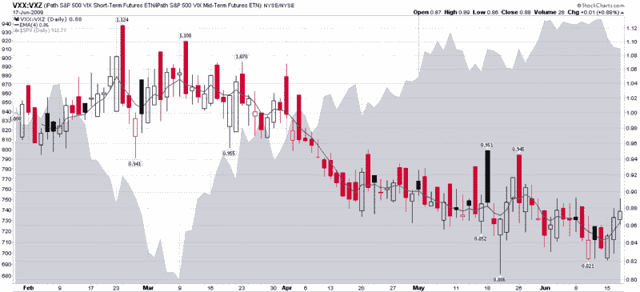

<!--yml

类别：未分类

日期：2024 年 05 月 18 日 17:42:23

-->

# VIX and More：VXX:VXZ 比率

> 来源：[`vixandmore.blogspot.com/2009/06/vxxvxz-ratio.html#0001-01-01`](http://vixandmore.blogspot.com/2009/06/vxxvxz-ratio.html#0001-01-01)

自从 1 月 30 日推出以来，iPath S&P 500 VIX 短期期货 ETN（[VXX](http://vixandmore.blogspot.com/search/label/VXX)）已经吸引了热情的追随者，每天平均交易量为 40 万股。而同样不能说的是 VXX 的问题更多的兄弟，iPath S&P 500 VIX 中期期货 ETN（[VXZ](http://vixandmore.blogspot.com/search/label/VXZ)），其中 10 万股交易日更是例外而非规则。

尽管不太受欢迎，试图在大约五个月内复制 VIX 期货变化的 VXZ，不应被忽视。实际上，比较 VXZ 和 VXX 的波动提供了一些有趣的波动预期洞察。

以[VXX:VXZ 比例](http://vixandmore.blogspot.com/search/label/VXX%3AVXZ)为例。在某些方面，这个指标类似于我在 2007 年[介绍过的](http://vixandmore.blogspot.com/2007/12/vixvxv-ratio.html)VIX:VXV 比率。然而，这两个比率之间存在一些重要的区别，值得注意。首先，你可以交易 VXX 和 VXZ；VIX 和[VXV](http://vixandmore.blogspot.com/search/label/VXV)都不能直接交易。其次，VXX 和 VXZ 都是[交易所交易票据](http://en.wikipedia.org/wiki/Exchange_Traded_Notes)(ETNs)，而 VIX 和 VXV 是指数。最后，VXX 和 VXZ 展望一个月和五个月，而 VIX 和 VXV 指数展望一个月和三个月。

对于那些希望将近期波动率预期与数月后波动率预期进行比较的人来说，VIX:VXV 比率和 VXX:VXZ 比率都是很好的工具。从数据的角度来看，指数比率有 19 个月的实时历史数据。不幸的是，VXX:VXZ 比率只有 4 个半月的实时（即非重建）数据可供参考。另一方面，VXV 指数的数据有时很难获得，而 VXX 和 VXZ 的数据则广泛分布。

下图显示了 VXX:VXZ 比率的完整历史，使用 4 天 EMA（蓝线）作为平滑因子。虽然这个指标仍然相当年轻，但我发现最近比率的底部与 SPX 的顶部图案相吻合，这令人鼓舞。此外，3 月 9 日完成的比率双顶也与 SPX 的底部相吻合。

在未来，我将把 VXX:VXZ 比率与 VIX:VXV 比率进行比较，并对两个比率进行一些额外的审查。

*[来源：StockCharts.com] *

***披露****：在撰写本文时，长 VXX 和 VIX 中性仓位的选择权**
