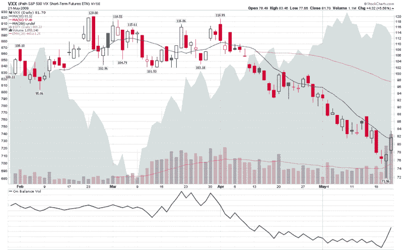

<!--yml

类别：未分类

日期：2024-05-18 17:46:29

-->

# VIX and More: VXX 成交量突破百万标志，投资者拥抱新的波动性 ETN

> 来源：[`vixandmore.blogspot.com/2009/05/vxx-volume-tops-million-mark-as.html#0001-01-01`](http://vixandmore.blogspot.com/2009/05/vxx-volume-tops-million-mark-as.html#0001-01-01)

当我昨天撰写的[《VXX 成交量创新高》](http://vixandmore.blogspot.com/2009/05/record-volume-in-vxx.html)时，我有一种直觉，认为以 VIX 为基础的波动性 ETN 很快就会有一个开门红。然而，我并没有预料到 [VXX](http://vixandmore.blogspot.com/search/label/VXX) 在短短 24 小时内会吸引如此多的关注。

随着今天的 1,094,140 股交易，VXX 现已正式进入大联盟，并肯定会被更多的散户投资者加入观察名单，并成为更多对冲基金的投资组合中的一部分。

下面的图表更新了昨天图表中的信息，并添加了一个关于成交量的研究，以突出昨天底部反弹的力度。

对于那些对 VXX 可能还很陌生的人来说，重要的是要记住，虽然 VXX 与 VIX 之间有很强的方向一致性（它们大约在每 7 个交易日中的 6 个中同向移动），但 VXX 的日常波动率只有现金/现货 VIX 的*一半*。因此，虽然在 [激励因素](http://vixandmore.blogspot.com/search/label/VXX%20juice%20factor)方面 VXX 可能落后于 VIX，但如果不希望在期权或期货市场上交易波动率，那么它可能是交易波动率的最佳方式。

如果这款近四个月大的波动性 ETN 能够有一个座右铭的话，也许就是：“当方向正确时，就足够了！”

欲了解更多关于 VXX 的信息，读者也可查阅：

**

*[来源：StockCharts]*

***披露****：撰写时长持有 VIX 和 VXX。*
