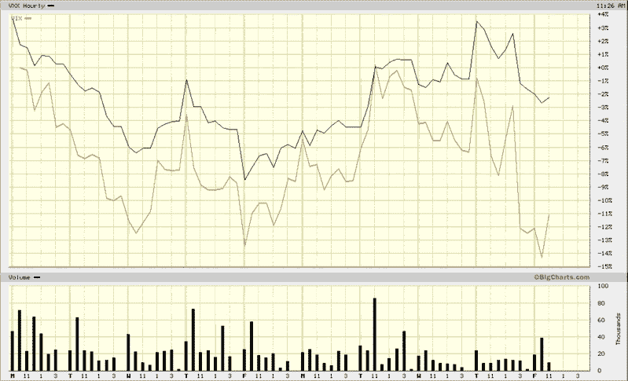

<!--yml

类别：未分类

日期：2024-05-18 18:00:15

-->

# VIX 与更多：VXX 和 VIX 出现背离

> 来源：[`vixandmore.blogspot.com/2009/02/vxx-and-vix-diverging.html#0001-01-01`](http://vixandmore.blogspot.com/2009/02/vxx-and-vix-diverging.html#0001-01-01)

对于波动性来说，这是一个有趣的一周，VIX 似乎有着自己的思维，并且对市场上一些重大变动反应相当迟缓。在大多数情况下，[VXX](http://vixandmore.blogspot.com/search/label/VXX)，这个新的[VIX ETN](http://vixandmore.blogspot.com/search/label/VIX%20ETN)，与 VIX 同步移动，只是波动性指数的大约 80%。

然而，今天标志着自 VXX [于 1 月 30 日开始交易](http://vixandmore.blogspot.com/2009/01/first-day-of-trading-in-vxx-and-vxz.html) 以来首次出现重大背离与 VIX 之间的差异。当我写这篇文章时，VXX 为当天下跌了 0.84%，而 VIX 上涨了 2.79% - 这种背离可以在下面十天图表的每小时柱状图中观察到。

我对今天的背离没有特别的解释。至少目前，我只是想提醒大家关注这一现象，并继续密切关注。

*[来源: BigCharts]*
