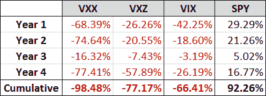

<!--yml

分类: 未分类

日期: 2024 年 05 月 18 日 16:18:49

-->

# VIX and More: VXX 和 VXZ 庆祝四周年

> 来源：[`vixandmore.blogspot.com/2013/01/vxx-and-vxz-celebrate-fourth-birthday.html#0001-01-01`](http://vixandmore.blogspot.com/2013/01/vxx-and-vxz-celebrate-fourth-birthday.html#0001-01-01)

庆祝生日的更好方式比获得巨额收益还有什么呢。这就是[VXX](http://vixandmore.blogspot.com/search/label/VXX)今天可能正在想的，因为它上涨了 6.2%，而它经常被忽视的姐妹品种[VXZ](http://vixandmore.blogspot.com/search/label/VXZ)上涨了 2.2%。

当然，过去四年对这些[VIX 交易所交易产品](http://vixandmore.blogspot.com/search/label/VIX%20ETN)来说并不友好，但在选定的时期，它们表现卓越。只需问问在 2011 年 7 月至 10 月期间 VXX 暴涨 198%时持有空头头寸的任何人。

尽管短期表现令人印象深刻，但自推出以来，VXX 和 VXZ 每年都失利。公平地说，对 VIX 也是一样，如果从每年的 1 月 30 日来衡量的话。

以下表格显示了 VXX、VXZ、VIX 和 SPY 在每年 1 月 30 日的表现。当考虑到在每个年度测量期间 SPY 上涨，VIX 下降时，两种开创性的 VIX ETP 的表现就更容易接受了。

*[来源: 雅虎, thinkorswim/TD Ameritrade, VIX and More]*

尽管早在 2009 年上半年就有些人对 VXX 和 VXZ 在这一领域的表现表示了一些担忧，但 VXX 仍然以 10.43 亿美元的资产规模排名 VIX ETP 的#1，而 VXZ 以 5700 万美元的规模排名第 8。

重申自推出以来我一直坚持的观点，VXX 和 VXZ 是适合于短期做多波动率头寸或在特定市场条件下长期持有的产品。对于那些对更多信息感兴趣的人，下面的链接应该提供一些极好的切入点。

鼓励所有投资者仔细研究[VXX 和 VXZ 的招股书](http://www.ipathetn.com/static/pdf/vix-prospectus.pdf)，以及所有 VIX 和波动率相关的交易所交易产品的更多信息。我还强烈鼓励这一领域的潜在投资者花些时间学习[VIX 期货](http://vixandmore.blogspot.com/search/label/VIX%20futures)、[反向市场](http://vixandmore.blogspot.com/search/label/contango)、[卷席收益](http://vixandmore.blogspot.com/search/label/roll%20yield)和其他相关主题的复杂性。

相关帖子：

***披露:*** *编写时空头 VXX*
