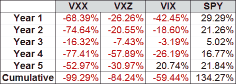

<!--yml

分类：未分类

日期：2024-05-18 16:11:21

-->

# VIX and More：VXX 和 VXZ 已满五周岁！

> 来源：[`vixandmore.blogspot.com/2014/01/vxx-and-vxz-now-five-years-old.html#0001-01-01`](http://vixandmore.blogspot.com/2014/01/vxx-and-vxz-now-five-years-old.html#0001-01-01)

在所有[新兴市场](http://vixandmore.blogspot.com/search/label/emerging%20markets)动荡之中，我想花一点时间来纪念两个开创性的[VIX ETPs](http://vixandmore.blogspot.com/search/label/VIX%20ETN)的五周年生日：[VXX](http://vixandmore.blogspot.com/search/label/VXX)和[VXZ](http://vixandmore.blogspot.com/search/label/VXZ)。 在股市触底于 2008-09 年金融危机前五周推出，VXX 和 VXZ 在过去五年中一直在逆境中挣扎，因为波动率持续下降，并且还受到[VIX 期货](http://vixandmore.blogspot.com/search/label/VIX%20futures)中持续的[远月溢价](http://vixandmore.blogspot.com/search/label/contango)的打击，这进一步形成了负[卷收益](http://vixandmore.blogspot.com/search/label/roll%20yield)的阻碍。

下表记录了这两个产品的悲惨历史，从 1 月 30 日到 1 月 30 日的产品生命周期年：

*[来源：CBOE，Yahoo，VIX and More]*

请注意，尽管这五年对于这两个产品来说都是亏损的年份，但在某些时期，这些产品曾是表现非常出色的。 其中一个时期是 2011 年 7 月至 10 月，当时 VXX 几乎翻了三番（最大涨幅为 198%），VXZ 上涨了约 66%。 我之所以提到这一点，是因为它们在 1 月份表现良好，截至我撰写本文时，VXX 上涨了 13.0%，VXZ 年初涨幅为 2.2%。

虽然我并不敢预测这两个 VIX ETP 的复兴，但它们是市场上最重要、最流动的 VIX ETP 之一，当市场经历出售周期或存在潜在危机时，它们可以成为吸引人的对冲或投机交易。

我早在它们推出之前就已经开始写作，并将继续对它们提出我的看法。

相关帖子：

***披露：*** *在撰写时，做空 VIX 和 VXX*

*[来源：CBOE，Yahoo，VIX and More]*
