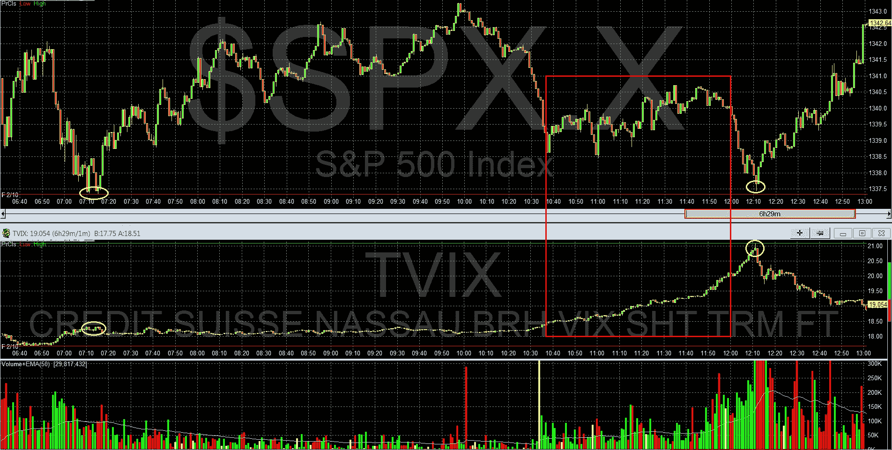

<!--yml

类别：未分类

日期：2024-05-18 16:40:33

-->

# VIX and More: 周五波动率变得不受控制

> 来源：[`vixandmore.blogspot.com/2012/02/volatility-becomes-unhinged-on-friday.html#0001-01-01`](http://vixandmore.blogspot.com/2012/02/volatility-becomes-unhinged-on-friday.html#0001-01-01)

在过去的一周中，VIX 上涨了 21.6%，而标准普尔 500 指数基本上没有变化（-0.17%）。在此期间，VIX 已经脱离了股票价格技术变化，更关注与希腊悲剧性喜剧的分支 —— [欧洲主权债务危机](http://vixandmore.blogspot.com/search/label/European%20sovereign%20debt%20crisis) —— 最新行动相关的事件风险或[事件波动性](http://vixandmore.blogspot.com/search/label/event%20volatility)。

如果你和我一样，你不断地重新调整对一个希腊违约可能性应该多严重这一令人困惑的问题的回答。好吧，市场也是如此。增加的复杂性在于每个人都必须消化同时变化的某些事件发生的概率，这些事件的影响程度，以及随时间可能引起的反响 —— 还有定期（看起来每天，通常在 ET 时间下午 3:58）需要考虑的一些重要新事件。

如果有人有欧洲主权债务危机希腊部分的概率树图，我认为看这些东西会很有趣。我想它会像是[苹果种植者约翰尼](http://en.wikipedia.org/wiki/Johnny_Appleseed)遇上[剪刀手爱德华](http://en.wikipedia.org/wiki/Edward_Scissorhands)那样。

回到波动性指数(VIX)的攀升，VIX 与 SPX 的脱钩在上周五的交易中变得非常显著。在下面的图表中，我捕捉了整个 SPX 和[TVIX](http://vixandmore.blogspot.com/search/label/TVIX)（VelocityShares Daily 2x VIX Short-Term ETN）的交易日，这相当于流行的[VXX](http://vixandmore.blogspot.com/search/label/VXX)（iPath S&P 500 VIX Short-Term Futures ETN）的 2 倍版本。值得一提的是，TVIX 的目标是达到一个持有前一个月和第二个月 VIX 期货的投资组合的日回报率的 2 倍，平均加权期限为 30 天。

在下图中，我用大红色矩形圈出了大约 83 分钟（上午 10:36 – 上午 11:59 PT）的时期，在这段时间内，标普 500 指数持续上升，然而 TVIX 却与传统背道而驰，戏剧性地上涨了 8.9%。对于通常朝相反方向交易的两种证券来说，这是一种非常不寻常的脱钩现象。事实上，脱钩可能低估了这种关系的变化，这种关系在当天完全失控。请注意黄色椭圆，标记了 SPX 相隔五个小时的两个低点。在这五个小时内，SPX 保持不变，然而 TVIX 在同一时间段内激增了**15.5%** (!)。这是我记忆中观察到的与正常的负相关关系相比最大的一次日内偏离。

**

*[来源：QuoteTracker/TD Ameritrade]*

在标普 500 指数（SPX）保持平稳的情况下，波动率指数（VIX）上周飙升了 21.6%，这并不是 VIX 在 SPX 保持不变的情况下首次以如此戏剧性的方式飙升。事实上，恰好三年多前，VIX 在 SPX 微弱上涨了 0.3%的一周中，VIX 飙升了 25%。那一周是 2008 年 9 月 15 日的一周，当时[雷曼兄弟](http://vixandmore.blogspot.com/search/label/LEH)申请破产。

相关帖子：

****披露：*** *撰写时持有 TVIX 和 VXX 空头**
